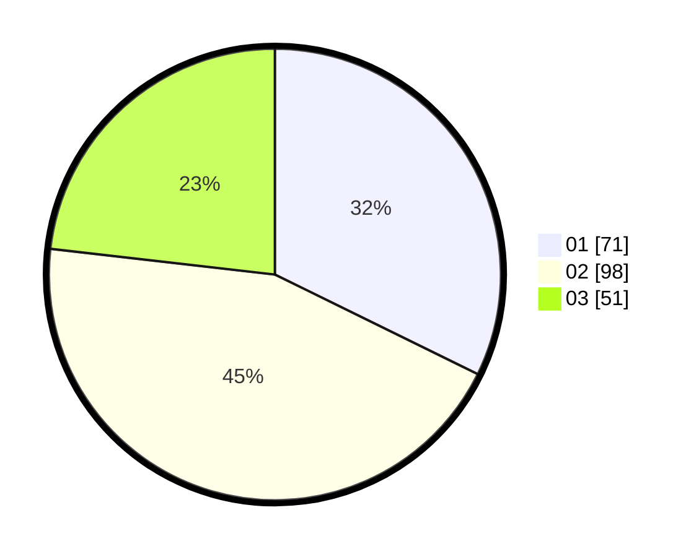

# Hasil

Hasil perolehan suara paslon dapat dilihat pada file paslon-01.txt, paslon-02.txt, dan paslon-03.txt.

Jika tidak ada, artinya data tersebut belum ada pada SIREKAP.

## Perolehan Suara

 * Paslon 01: **71**.
 * Paslon 02: **98**.
 * Paslon 03: **51**.

## Foto C Plano

https://sirekap-obj-formc.kpu.go.id/8c18/pemilu/ppwp/31/75/01/10/06/3175011006078-20240214-224721--1842c67e-e46b-4b9f-bccf-fb5e38597439.jpg

https://sirekap-obj-formc.kpu.go.id/8c18/pemilu/ppwp/31/75/01/10/06/3175011006078-20240214-215111--9a9bd192-77d6-4792-a28a-578868ea1b4e.jpg

https://sirekap-obj-formc.kpu.go.id/8c18/pemilu/ppwp/31/75/01/10/06/3175011006078-20240214-215222--ffd5dcd1-2056-4558-a2ce-ef0960f5ca4e.jpg
