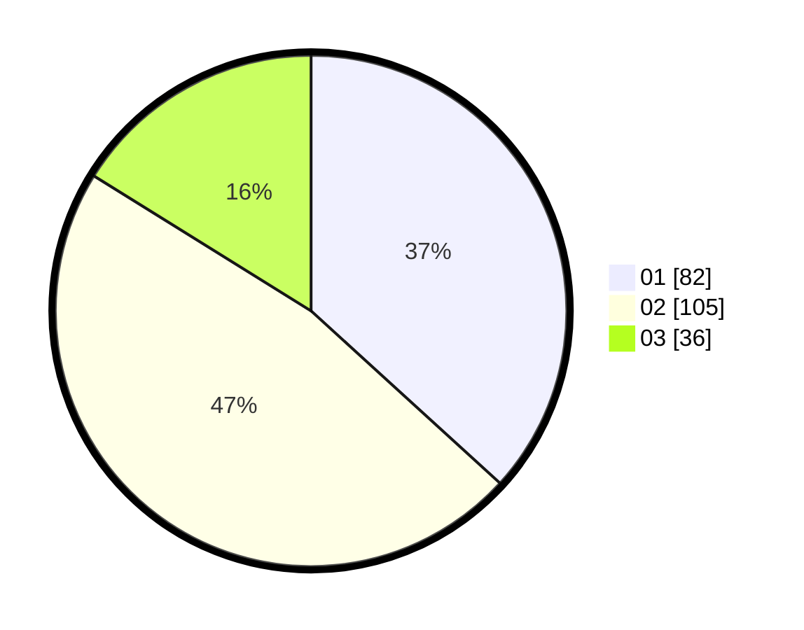

# Hasil

Hasil perolehan suara paslon dapat dilihat pada file paslon-01.txt, paslon-02.txt, dan paslon-03.txt.

Jika tidak ada, artinya data tersebut belum ada pada SIREKAP.

## Perolehan Suara

 * Paslon 01: **82**.
 * Paslon 02: **105**.
 * Paslon 03: **36**.

## Foto C Plano

https://sirekap-obj-formc.kpu.go.id/bf23/pemilu/ppwp/31/75/01/10/06/3175011006090-20240215-041949--7b3d4dff-b0c1-4d86-b01c-704592402285.jpg

https://sirekap-obj-formc.kpu.go.id/bf23/pemilu/ppwp/31/75/01/10/06/3175011006090-20240215-042034--56afa594-e7e8-43a1-9aba-316228dadf92.jpg

https://sirekap-obj-formc.kpu.go.id/bf23/pemilu/ppwp/31/75/01/10/06/3175011006090-20240215-042214--b7fc0267-06d6-4766-9a65-da79eed575ae.jpg
