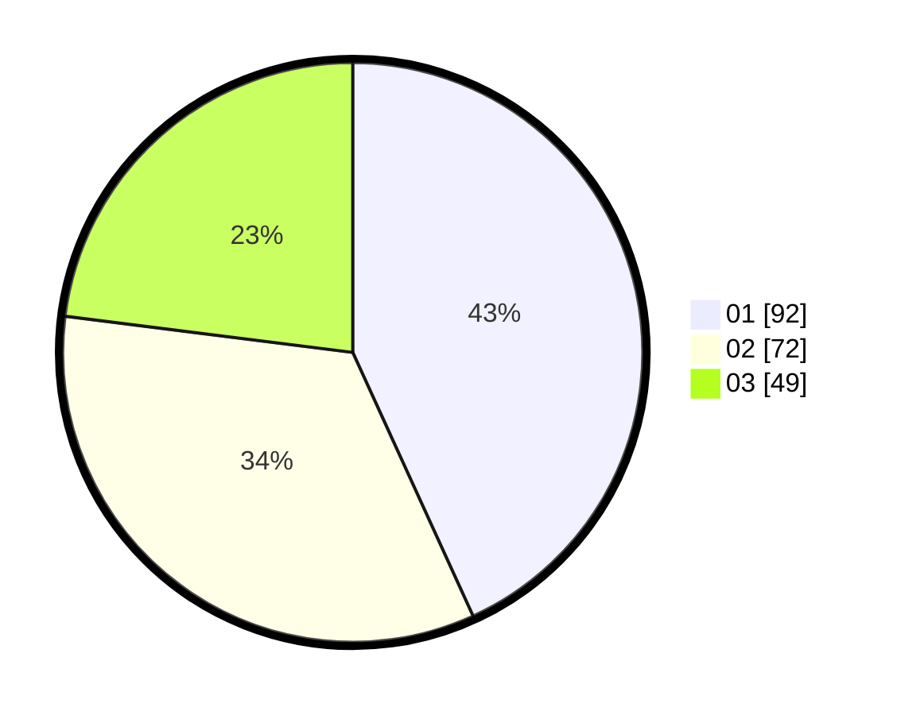

# Hasil

Hasil perolehan suara paslon dapat dilihat pada file paslon-01.txt, paslon-02.txt, dan paslon-03.txt.

Jika tidak ada, artinya data tersebut belum ada pada SIREKAP.

## Perolehan Suara

 * Paslon 01: **92**.
 * Paslon 02: **72**.
 * Paslon 03: **49**.

## Foto C Plano

https://sirekap-obj-formc.kpu.go.id/17c1/pemilu/ppwp/31/75/01/10/06/3175011006091-20240214-191409--7d465ae2-af21-42c1-986a-05c7fc083519.jpg

https://sirekap-obj-formc.kpu.go.id/17c1/pemilu/ppwp/31/75/01/10/06/3175011006091-20240214-191419--18b842e5-8cb8-40f0-badf-62e530a74913.jpg

https://sirekap-obj-formc.kpu.go.id/17c1/pemilu/ppwp/31/75/01/10/06/3175011006091-20240214-191427--a4cd437a-4866-4d55-a5a7-0207c17e4b5a.jpg

## DATA PEMILIH TETAP

Jumlah pemilih dalam DPT: **258**.
 * L: **121**.
 * P: **137**.

## DATA PENGGUNA HAK PILIH

Jumlah pengguna hak pilih dalam DPT: **214**.
 * L: **96**.
 * P: **118**.

Jumlah pengguna hak pilih dalam DPTb: **1**.
 * L: **1**.
 * P: **0**.

Jumlah pengguna hak pilih dalam DPK: **2**.
 * L: **1**.
 * P: **1**.

Jumlah pengguna hak pilih: **217**.
 * L: **98**.
 * P: **119**.

## JUMLAH SUARA SAH DAN TIDAK SAH

JUMLAH SELURUH SUARA SAH: **213**.

JUMLAH SUARA TIDAK SAH: **4**.

JUMLAH SELURUH SUARA SAH DAN SUARA TIDAK SAH: **217**.
