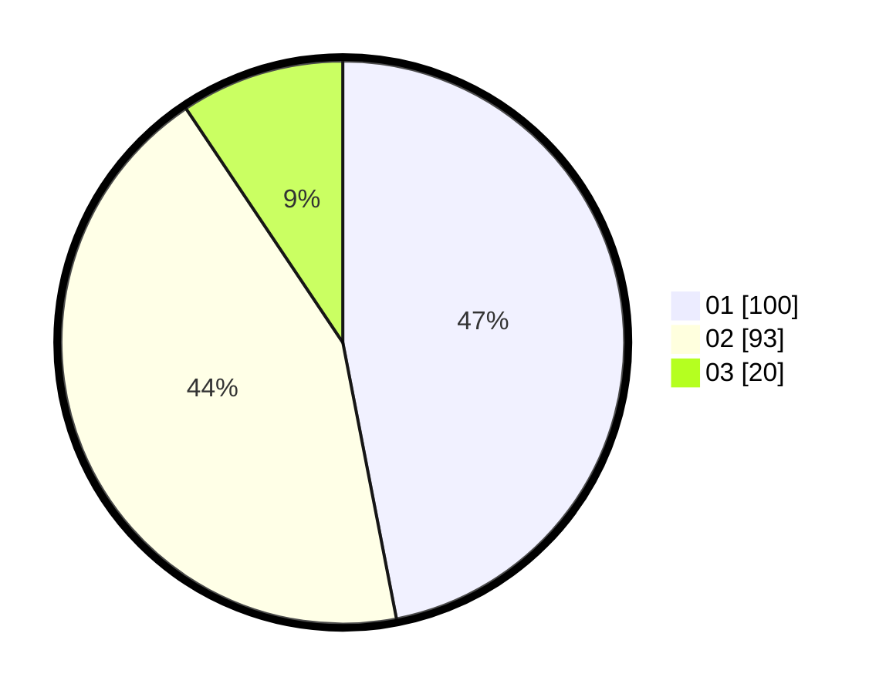

# Hasil

Hasil perolehan suara paslon dapat dilihat pada file paslon-01.txt, paslon-02.txt, dan paslon-03.txt.

Jika tidak ada, artinya data tersebut belum ada pada SIREKAP.

## Perolehan Suara

 * Paslon 01: **100**.
 * Paslon 02: **93**.
 * Paslon 03: **20**.

## Foto C Plano

https://sirekap-obj-formc.kpu.go.id/c29b/pemilu/ppwp/31/75/01/10/06/3175011006094-20240214-192147--87eb8eb3-6bda-417a-af51-94012ed9be0d.jpg

https://sirekap-obj-formc.kpu.go.id/c29b/pemilu/ppwp/31/75/01/10/06/3175011006094-20240214-193600--17dd700f-854b-4c6c-9f82-f448448e408f.jpg

https://sirekap-obj-formc.kpu.go.id/c29b/pemilu/ppwp/31/75/01/10/06/3175011006094-20240214-192954--4dfd64da-c34a-4569-9a88-4ac03bce21d1.jpg

## DATA PEMILIH TETAP

Jumlah pemilih dalam DPT: **255**.
 * L: **131**.
 * P: **124**.

## DATA PENGGUNA HAK PILIH

Jumlah pengguna hak pilih dalam DPT: **211**.
 * L: **104**.
 * P: **107**.

Jumlah pengguna hak pilih dalam DPTb: **3**.
 * L: **2**.
 * P: **1**.

Jumlah pengguna hak pilih dalam DPK: **2**.
 * L: **1**.
 * P: **1**.

Jumlah pengguna hak pilih: **216**.
 * L: **107**.
 * P: **109**.

## JUMLAH SUARA SAH DAN TIDAK SAH

JUMLAH SELURUH SUARA SAH: **213**.

JUMLAH SUARA TIDAK SAH: **3**.

JUMLAH SELURUH SUARA SAH DAN SUARA TIDAK SAH: **216**.
