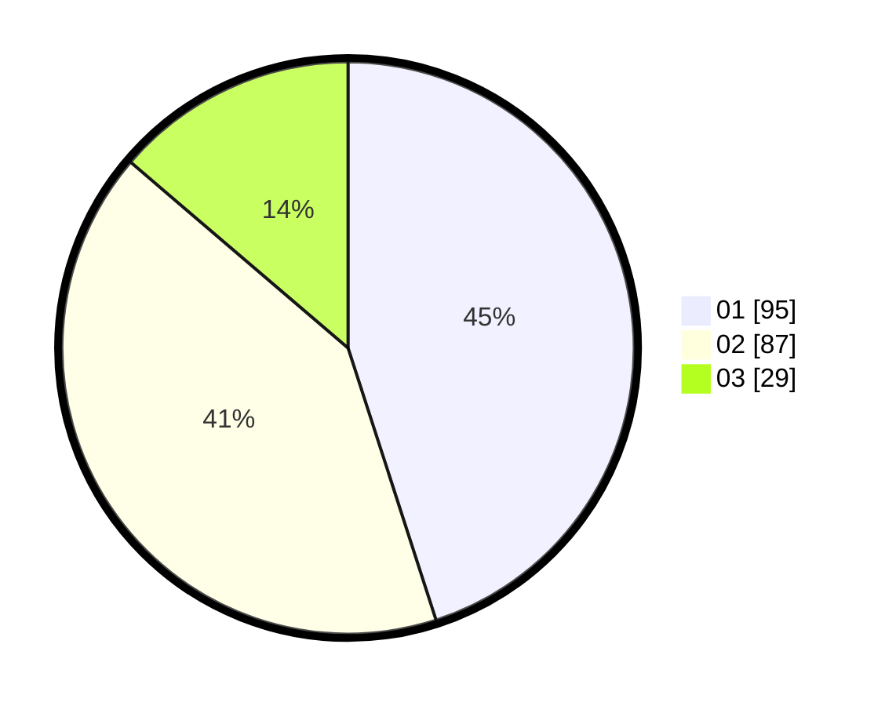

# Hasil

Hasil perolehan suara paslon dapat dilihat pada file paslon-01.txt, paslon-02.txt, dan paslon-03.txt.

Jika tidak ada, artinya data tersebut belum ada pada SIREKAP.

## Perolehan Suara

 * Paslon 01: **95**.
 * Paslon 02: **87**.
 * Paslon 03: **29**.

## Foto C Plano

https://sirekap-obj-formc.kpu.go.id/9df5/pemilu/ppwp/31/75/01/10/06/3175011006096-20240214-190653--45f61367-bcab-4918-a2f6-f01ff628ea96.jpg

https://sirekap-obj-formc.kpu.go.id/9df5/pemilu/ppwp/31/75/01/10/06/3175011006096-20240214-190839--a64bbf36-907d-4738-9c6f-1e7cf73e360b.jpg

https://sirekap-obj-formc.kpu.go.id/9df5/pemilu/ppwp/31/75/01/10/06/3175011006096-20240214-190944--8a9e12db-332d-4cee-96e5-08cae39532f6.jpg

## DATA PEMILIH TETAP

Jumlah pemilih dalam DPT: **262**.
 * L: **130**.
 * P: **132**.

## DATA PENGGUNA HAK PILIH

Jumlah pengguna hak pilih dalam DPT: **216**.
 * L: **106**.
 * P: **110**.

Jumlah pengguna hak pilih dalam DPTb: **3**.
 * L: **1**.
 * P: **2**.

Jumlah pengguna hak pilih dalam DPK: **0**.
 * L: **0**.
 * P: **0**.

Jumlah pengguna hak pilih: **219**.
 * L: **107**.
 * P: **112**.

## JUMLAH SUARA SAH DAN TIDAK SAH

JUMLAH SELURUH SUARA SAH: **211**.

JUMLAH SUARA TIDAK SAH: **8**.

JUMLAH SELURUH SUARA SAH DAN SUARA TIDAK SAH: **219**.
