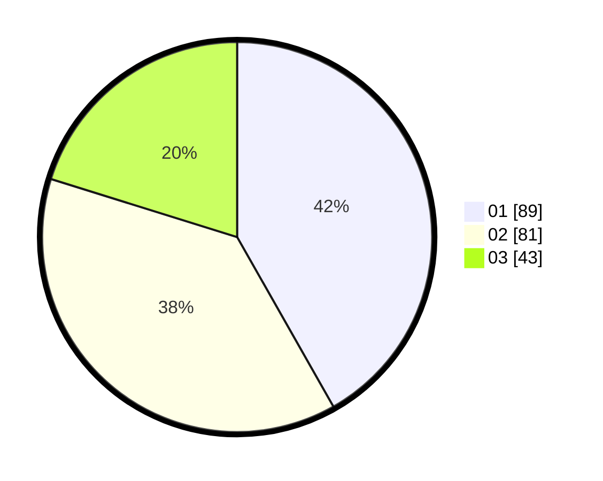

# Hasil

Hasil perolehan suara paslon dapat dilihat pada file paslon-01.txt, paslon-02.txt, dan paslon-03.txt.

Jika tidak ada, artinya data tersebut belum ada pada SIREKAP.

## Perolehan Suara

 * Paslon 01: **89**.
 * Paslon 02: **81**.
 * Paslon 03: **43**.

## Foto C Plano

https://sirekap-obj-formc.kpu.go.id/5b65/pemilu/ppwp/31/75/01/10/06/3175011006102-20240214-203202--dab2be06-7b4b-4015-a73f-d42706f60386.jpg

https://sirekap-obj-formc.kpu.go.id/5b65/pemilu/ppwp/31/75/01/10/06/3175011006102-20240214-205809--7751737c-503f-4ec5-bd5c-d07375fd866e.jpg

https://sirekap-obj-formc.kpu.go.id/5b65/pemilu/ppwp/31/75/01/10/06/3175011006102-20240214-201147--e520b502-425a-4358-8e11-b7178e36952b.jpg

## DATA PEMILIH TETAP

Jumlah pemilih dalam DPT: **261**.
 * L: **126**.
 * P: **135**.

## DATA PENGGUNA HAK PILIH

Jumlah pengguna hak pilih dalam DPT: **213**.
 * L: **101**.
 * P: **112**.

Jumlah pengguna hak pilih dalam DPTb: **5**.
 * L: **2**.
 * P: **3**.

Jumlah pengguna hak pilih dalam DPK: **2**.
 * L: **0**.
 * P: **2**.

Jumlah pengguna hak pilih: **220**.
 * L: **103**.
 * P: **117**.

## JUMLAH SUARA SAH DAN TIDAK SAH

JUMLAH SELURUH SUARA SAH: **213**.

JUMLAH SUARA TIDAK SAH: **7**.

JUMLAH SELURUH SUARA SAH DAN SUARA TIDAK SAH: **220**.
