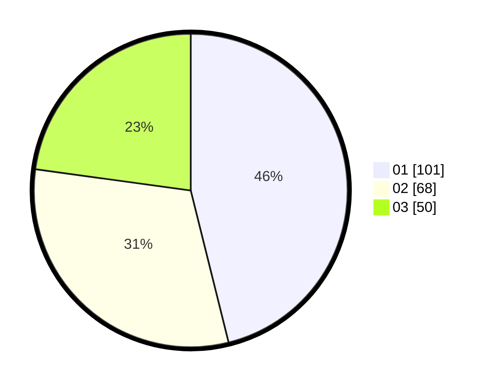

# Hasil

Hasil perolehan suara paslon dapat dilihat pada file paslon-01.txt, paslon-02.txt, dan paslon-03.txt.

Jika tidak ada, artinya data tersebut belum ada pada SIREKAP.

## Perolehan Suara

 * Paslon 01: **101**.
 * Paslon 02: **68**.
 * Paslon 03: **50**.

## Foto C Plano

https://sirekap-obj-formc.kpu.go.id/5805/pemilu/ppwp/31/75/01/10/06/3175011006103-20240214-202106--fc2d5d07-f71b-481f-b34c-543a10b7ac79.jpg

https://sirekap-obj-formc.kpu.go.id/5805/pemilu/ppwp/31/75/01/10/06/3175011006103-20240214-202129--477ca677-f014-4403-9603-30fd506a65ee.jpg

https://sirekap-obj-formc.kpu.go.id/5805/pemilu/ppwp/31/75/01/10/06/3175011006103-20240214-202155--b1f6fb26-6c5b-41f9-8413-bb2565bc26ed.jpg

## DATA PEMILIH TETAP

Jumlah pemilih dalam DPT: **262**.
 * L: **130**.
 * P: **132**.

## DATA PENGGUNA HAK PILIH

Jumlah pengguna hak pilih dalam DPT: **214**.
 * L: **103**.
 * P: **111**.

Jumlah pengguna hak pilih dalam DPTb: **5**.
 * L: **3**.
 * P: **2**.

Jumlah pengguna hak pilih dalam DPK: **3**.
 * L: **1**.
 * P: **2**.

Jumlah pengguna hak pilih: **222**.
 * L: **107**.
 * P: **115**.

## JUMLAH SUARA SAH DAN TIDAK SAH

JUMLAH SELURUH SUARA SAH: **219**.

JUMLAH SUARA TIDAK SAH: **3**.

JUMLAH SELURUH SUARA SAH DAN SUARA TIDAK SAH: **222**.
