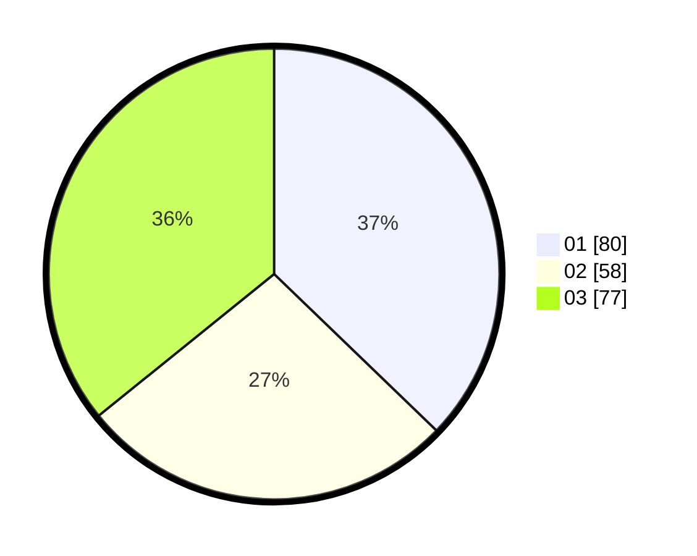

# Hasil

Hasil perolehan suara paslon dapat dilihat pada file paslon-01.txt, paslon-02.txt, dan paslon-03.txt.

Jika tidak ada, artinya data tersebut belum ada pada SIREKAP.

## Perolehan Suara

 * Paslon 01: **80**.
 * Paslon 02: **58**.
 * Paslon 03: **77**.

## Foto C Plano

https://sirekap-obj-formc.kpu.go.id/6a15/pemilu/ppwp/31/75/01/10/06/3175011006110-20240214-230829--db293f0d-56bb-4e56-959e-5a1beeb08cb5.jpg

https://sirekap-obj-formc.kpu.go.id/6a15/pemilu/ppwp/31/75/01/10/06/3175011006110-20240214-231204--46f0b6f2-1f63-40bc-b2c3-80aed17e2f46.jpg

https://sirekap-obj-formc.kpu.go.id/6a15/pemilu/ppwp/31/75/01/10/06/3175011006110-20240214-231541--a29877e6-b5ab-4809-9c4a-46a16f335f19.jpg
