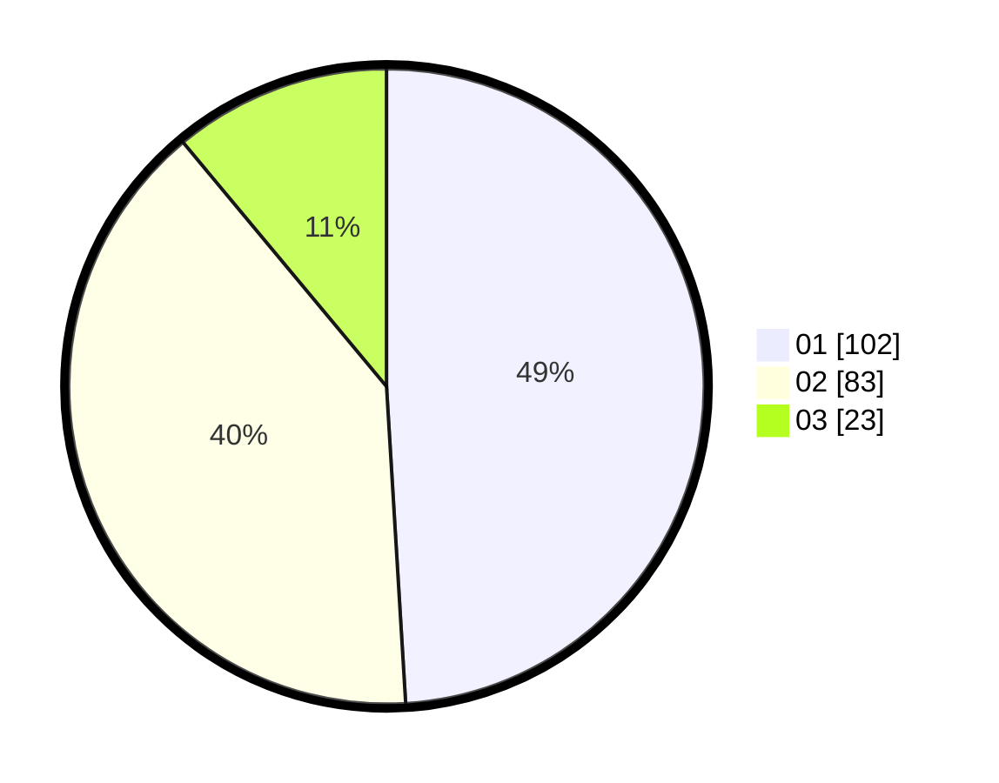

# Hasil

Hasil perolehan suara paslon dapat dilihat pada file paslon-01.txt, paslon-02.txt, dan paslon-03.txt.

Jika tidak ada, artinya data tersebut belum ada pada SIREKAP.

## Perolehan Suara

 * Paslon 01: **102**.
 * Paslon 02: **83**.
 * Paslon 03: **23**.

## Foto C Plano

https://sirekap-obj-formc.kpu.go.id/380f/pemilu/ppwp/31/75/01/10/06/3175011006111-20240214-155056--8d4d6088-5dd0-40de-898b-1d19fcece202.jpg

https://sirekap-obj-formc.kpu.go.id/380f/pemilu/ppwp/31/75/01/10/06/3175011006111-20240214-184722--989793f9-53b5-474b-900c-00c96bd89e84.jpg

https://sirekap-obj-formc.kpu.go.id/380f/pemilu/ppwp/31/75/01/10/06/3175011006111-20240214-184648--3b490e39-8f42-4570-82c5-47f5720e1ea2.jpg

## DATA PEMILIH TETAP

Jumlah pemilih dalam DPT: **233**.
 * L: **112**.
 * P: **121**.

## DATA PENGGUNA HAK PILIH

Jumlah pengguna hak pilih dalam DPT: **208**.
 * L: **103**.
 * P: **105**.

Jumlah pengguna hak pilih dalam DPTb: **0**.
 * L: **0**.
 * P: **0**.

Jumlah pengguna hak pilih dalam DPK: **4**.
 * L: **2**.
 * P: **2**.

Jumlah pengguna hak pilih: **212**.
 * L: **105**.
 * P: **107**.

## JUMLAH SUARA SAH DAN TIDAK SAH

JUMLAH SELURUH SUARA SAH: **208**.

JUMLAH SUARA TIDAK SAH: **4**.

JUMLAH SELURUH SUARA SAH DAN SUARA TIDAK SAH: **212**.
