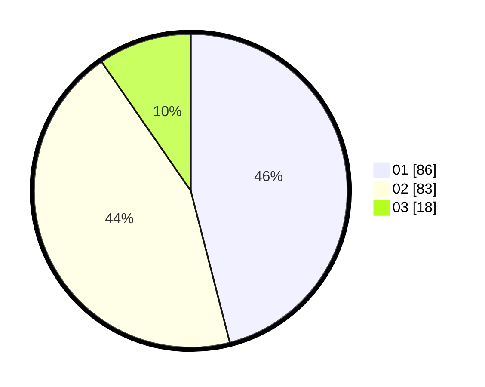

# Hasil

Hasil perolehan suara paslon dapat dilihat pada file paslon-01.txt, paslon-02.txt, dan paslon-03.txt.

Jika tidak ada, artinya data tersebut belum ada pada SIREKAP.

## Perolehan Suara

 * Paslon 01: **86**.
 * Paslon 02: **83**.
 * Paslon 03: **18**.

## Foto C Plano

https://sirekap-obj-formc.kpu.go.id/1531/pemilu/ppwp/31/75/01/10/06/3175011006114-20240214-155510--b456d179-de12-45f0-9bc5-dc9b30ac9748.jpg

https://sirekap-obj-formc.kpu.go.id/1531/pemilu/ppwp/31/75/01/10/06/3175011006114-20240214-160110--070b50f5-42b5-4311-b1df-3ec88be0182b.jpg

https://sirekap-obj-formc.kpu.go.id/1531/pemilu/ppwp/31/75/01/10/06/3175011006114-20240214-155559--67d22c26-f578-46e9-8447-977cf9ee9321.jpg

## DATA PEMILIH TETAP

Jumlah pemilih dalam DPT: **236**.
 * L: **123**.
 * P: **113**.

## DATA PENGGUNA HAK PILIH

Jumlah pengguna hak pilih dalam DPT: **187**.
 * L: **90**.
 * P: **97**.

Jumlah pengguna hak pilih dalam DPTb: **0**.
 * L: **0**.
 * P: **0**.

Jumlah pengguna hak pilih dalam DPK: **0**.
 * L: **0**.
 * P: **0**.

Jumlah pengguna hak pilih: **187**.
 * L: **90**.
 * P: **97**.

## JUMLAH SUARA SAH DAN TIDAK SAH

JUMLAH SELURUH SUARA SAH: **187**.

JUMLAH SUARA TIDAK SAH: **0**.

JUMLAH SELURUH SUARA SAH DAN SUARA TIDAK SAH: **187**.
