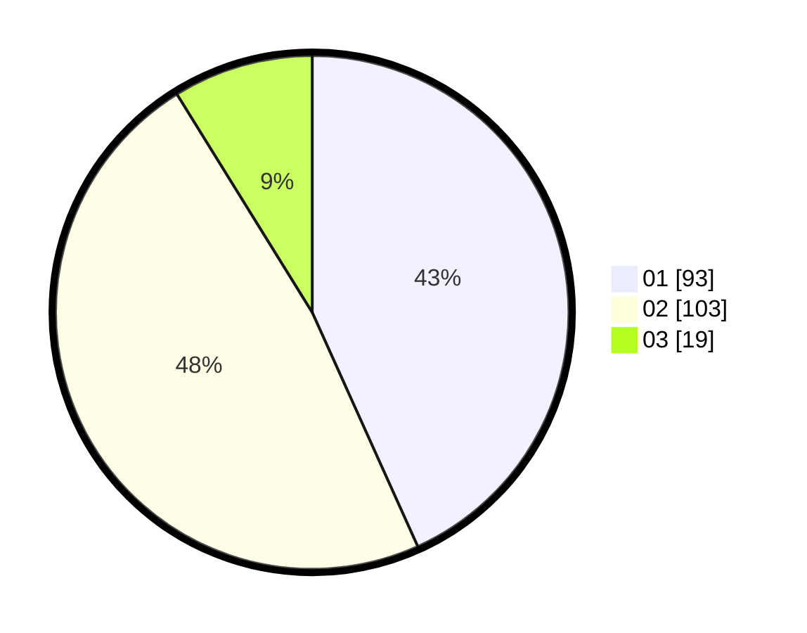

# Hasil

Hasil perolehan suara paslon dapat dilihat pada file paslon-01.txt, paslon-02.txt, dan paslon-03.txt.

Jika tidak ada, artinya data tersebut belum ada pada SIREKAP.

## Perolehan Suara

 * Paslon 01: **93**.
 * Paslon 02: **103**.
 * Paslon 03: **19**.

## Foto C Plano

https://sirekap-obj-formc.kpu.go.id/0e87/pemilu/ppwp/31/75/02/10/01/3175021001011-20240214-155043--c95e4e80-e5a6-4a74-8201-5a6f45ac34f5.jpg

https://sirekap-obj-formc.kpu.go.id/0e87/pemilu/ppwp/31/75/02/10/01/3175021001011-20240214-155333--bf5ee271-3389-4e66-bc4e-6d5663c7ec76.jpg

https://sirekap-obj-formc.kpu.go.id/0e87/pemilu/ppwp/31/75/02/10/01/3175021001011-20240214-155444--72306ede-8d74-44e3-b77b-5f1c937cc99c.jpg

## DATA PEMILIH TETAP

Jumlah pemilih dalam DPT: **273**.
 * L: **144**.
 * P: **129**.

## DATA PENGGUNA HAK PILIH

Jumlah pengguna hak pilih dalam DPT: **206**.
 * L: **108**.
 * P: **98**.

Jumlah pengguna hak pilih dalam DPTb: **14**.
 * L: **5**.
 * P: **9**.

Jumlah pengguna hak pilih dalam DPK: **0**.
 * L: **0**.
 * P: **0**.

Jumlah pengguna hak pilih: **220**.
 * L: **113**.
 * P: **107**.

## JUMLAH SUARA SAH DAN TIDAK SAH

JUMLAH SELURUH SUARA SAH: **215**.

JUMLAH SUARA TIDAK SAH: **5**.

JUMLAH SELURUH SUARA SAH DAN SUARA TIDAK SAH: **220**.
