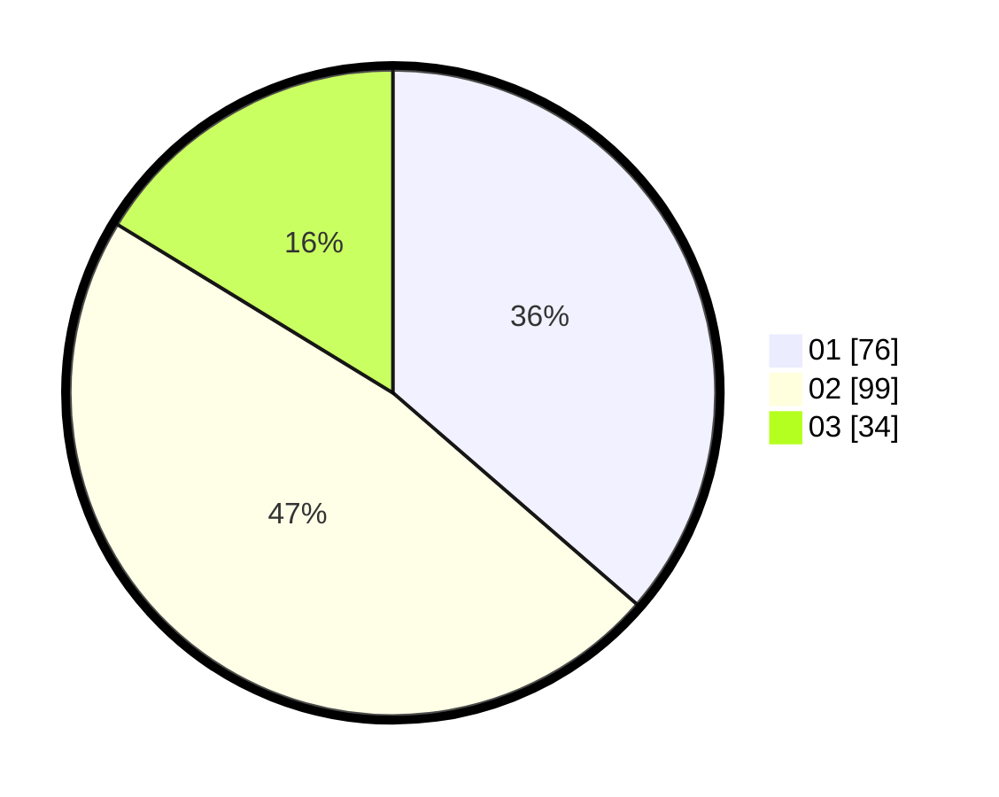

# Hasil

Hasil perolehan suara paslon dapat dilihat pada file paslon-01.txt, paslon-02.txt, dan paslon-03.txt.

Jika tidak ada, artinya data tersebut belum ada pada SIREKAP.

## Perolehan Suara

 * Paslon 01: **76**.
 * Paslon 02: **99**.
 * Paslon 03: **34**.

## Foto C Plano

https://sirekap-obj-formc.kpu.go.id/1991/pemilu/ppwp/31/75/02/10/01/3175021001014-20240215-061224--cd704a8b-eff1-4864-9736-93ecb3b6db18.jpg

https://sirekap-obj-formc.kpu.go.id/1991/pemilu/ppwp/31/75/02/10/01/3175021001014-20240215-061248--cd201ae1-eb38-4067-930d-3d598a3633c0.jpg

https://sirekap-obj-formc.kpu.go.id/1991/pemilu/ppwp/31/75/02/10/01/3175021001014-20240215-061234--da2a8e37-6ff2-47cd-bc51-64f1bc625cc3.jpg

## DATA PEMILIH TETAP

Jumlah pemilih dalam DPT: **291**.
 * L: **150**.
 * P: **141**.

## DATA PENGGUNA HAK PILIH

Jumlah pengguna hak pilih dalam DPT: **206**.
 * L: **102**.
 * P: **104**.

Jumlah pengguna hak pilih dalam DPTb: **6**.
 * L: **2**.
 * P: **4**.

Jumlah pengguna hak pilih dalam DPK: **0**.
 * L: **0**.
 * P: **0**.

Jumlah pengguna hak pilih: **212**.
 * L: **104**.
 * P: **108**.

## JUMLAH SUARA SAH DAN TIDAK SAH

JUMLAH SELURUH SUARA SAH: **209**.

JUMLAH SUARA TIDAK SAH: **3**.

JUMLAH SELURUH SUARA SAH DAN SUARA TIDAK SAH: **212**.
