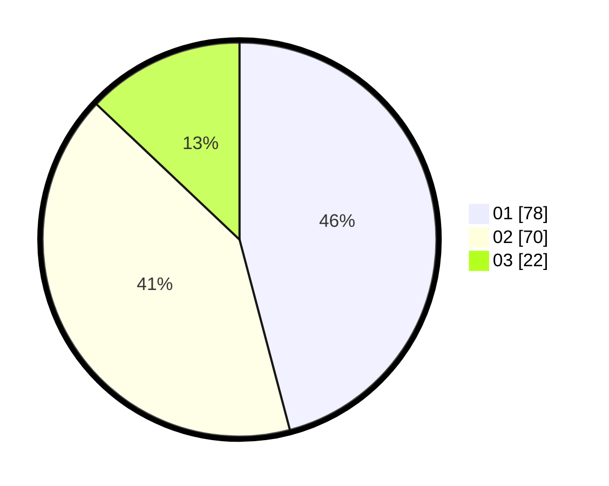

# Hasil

Hasil perolehan suara paslon dapat dilihat pada file paslon-01.txt, paslon-02.txt, dan paslon-03.txt.

Jika tidak ada, artinya data tersebut belum ada pada SIREKAP.

## Perolehan Suara

 * Paslon 01: **78**.
 * Paslon 02: **70**.
 * Paslon 03: **22**.

## Foto C Plano

https://sirekap-obj-formc.kpu.go.id/3703/pemilu/ppwp/31/75/02/10/01/3175021001018-20240214-220407--f8d71e85-3918-49c2-99c1-f61209bd5525.jpg

https://sirekap-obj-formc.kpu.go.id/3703/pemilu/ppwp/31/75/02/10/01/3175021001018-20240214-220706--ee73fdb5-2368-4ec1-b345-24a3e43cb68c.jpg

https://sirekap-obj-formc.kpu.go.id/3703/pemilu/ppwp/31/75/02/10/01/3175021001018-20240214-221000--0c652b88-77ee-49b7-8d3a-91177663b98e.jpg
