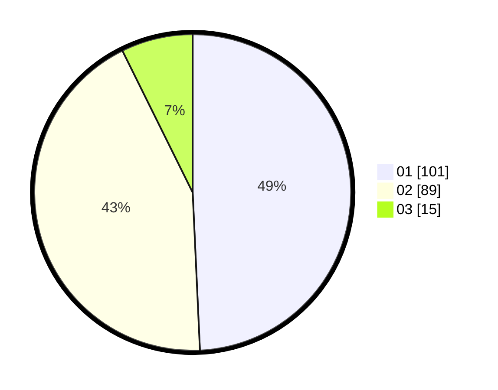

# Hasil

Hasil perolehan suara paslon dapat dilihat pada file paslon-01.txt, paslon-02.txt, dan paslon-03.txt.

Jika tidak ada, artinya data tersebut belum ada pada SIREKAP.

## Perolehan Suara

 * Paslon 01: **101**.
 * Paslon 02: **89**.
 * Paslon 03: **15**.

## Foto C Plano

https://sirekap-obj-formc.kpu.go.id/9a8c/pemilu/ppwp/31/75/02/10/01/3175021001021-20240216-044250--644caa09-7388-44db-bd50-70f877724f0e.jpg

https://sirekap-obj-formc.kpu.go.id/9a8c/pemilu/ppwp/31/75/02/10/01/3175021001021-20240216-044251--fae69109-26c4-4620-87cc-8b525ff7ff93.jpg

https://sirekap-obj-formc.kpu.go.id/9a8c/pemilu/ppwp/31/75/02/10/01/3175021001021-20240216-044250--4f33351c-73cd-4ff2-a296-5f7521efd28c.jpg

## DATA PEMILIH TETAP

Jumlah pemilih dalam DPT: **267**.
 * L: **141**.
 * P: **126**.

## DATA PENGGUNA HAK PILIH

Jumlah pengguna hak pilih dalam DPT: **208**.
 * L: **107**.
 * P: **101**.

Jumlah pengguna hak pilih dalam DPTb: **0**.
 * L: **0**.
 * P: **0**.

Jumlah pengguna hak pilih dalam DPK: **0**.
 * L: **0**.
 * P: **0**.

Jumlah pengguna hak pilih: **208**.
 * L: **107**.
 * P: **101**.

## JUMLAH SUARA SAH DAN TIDAK SAH

JUMLAH SELURUH SUARA SAH: **205**.

JUMLAH SUARA TIDAK SAH: **1**.

JUMLAH SELURUH SUARA SAH DAN SUARA TIDAK SAH: **206**.
