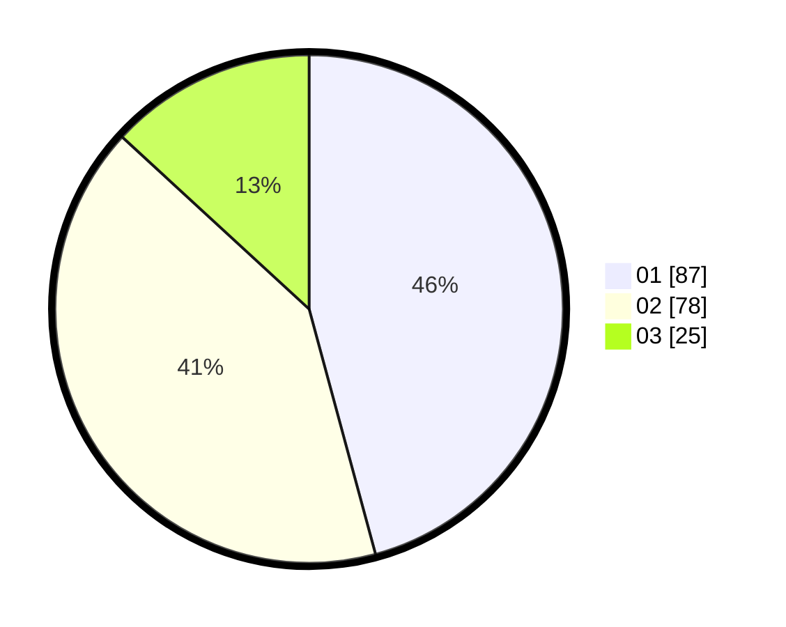

# Hasil

Hasil perolehan suara paslon dapat dilihat pada file paslon-01.txt, paslon-02.txt, dan paslon-03.txt.

Jika tidak ada, artinya data tersebut belum ada pada SIREKAP.

## Perolehan Suara

 * Paslon 01: **87**.
 * Paslon 02: **78**.
 * Paslon 03: **25**.

## Foto C Plano

https://sirekap-obj-formc.kpu.go.id/b2f5/pemilu/ppwp/31/75/02/10/01/3175021001025-20240216-073454--eb6a1363-7f43-484f-b03a-bccd2c77a872.jpg

https://sirekap-obj-formc.kpu.go.id/b2f5/pemilu/ppwp/31/75/02/10/01/3175021001025-20240216-071109--6a0c2887-270d-4f80-ac06-b535389c219e.jpg

https://sirekap-obj-formc.kpu.go.id/b2f5/pemilu/ppwp/31/75/02/10/01/3175021001025-20240216-071101--807f7aa5-251f-4734-b70a-adac56b5b5de.jpg

## DATA PEMILIH TETAP

Jumlah pemilih dalam DPT: **0**.
 * L: **0**.
 * P: **0**.

## DATA PENGGUNA HAK PILIH

Jumlah pengguna hak pilih dalam DPT: **0**.
 * L: **0**.
 * P: **0**.

Jumlah pengguna hak pilih dalam DPTb: **0**.
 * L: **0**.
 * P: **0**.

Jumlah pengguna hak pilih dalam DPK: **0**.
 * L: **0**.
 * P: **0**.

Jumlah pengguna hak pilih: **0**.
 * L: **0**.
 * P: **0**.

## JUMLAH SUARA SAH DAN TIDAK SAH

JUMLAH SELURUH SUARA SAH: **190**.

JUMLAH SUARA TIDAK SAH: **3**.

JUMLAH SELURUH SUARA SAH DAN SUARA TIDAK SAH: **193**.
