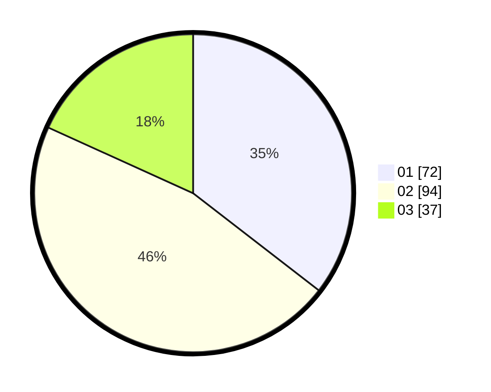

# Hasil

Hasil perolehan suara paslon dapat dilihat pada file paslon-01.txt, paslon-02.txt, dan paslon-03.txt.

Jika tidak ada, artinya data tersebut belum ada pada SIREKAP.

## Perolehan Suara

 * Paslon 01: **72**.
 * Paslon 02: **94**.
 * Paslon 03: **37**.

## Foto C Plano

https://sirekap-obj-formc.kpu.go.id/1fa8/pemilu/ppwp/31/75/02/10/01/3175021001030-20240215-213855--d38e1518-a93d-4070-83bf-4143705b7e14.jpg

https://sirekap-obj-formc.kpu.go.id/1fa8/pemilu/ppwp/31/75/02/10/01/3175021001030-20240215-213858--fd62a772-f287-4fb5-9858-fe806d550f3e.jpg

https://sirekap-obj-formc.kpu.go.id/1fa8/pemilu/ppwp/31/75/02/10/01/3175021001030-20240215-213856--e1ca8081-3a66-43ed-99d0-7c4e5c493b1e.jpg

## DATA PEMILIH TETAP

Jumlah pemilih dalam DPT: **202**.
 * L: **97**.
 * P: **105**.

## DATA PENGGUNA HAK PILIH

Jumlah pengguna hak pilih dalam DPT: **202**.
 * L: **97**.
 * P: **105**.

Jumlah pengguna hak pilih dalam DPTb: **4**.
 * L: **2**.
 * P: **2**.

Jumlah pengguna hak pilih dalam DPK: **0**.
 * L: **0**.
 * P: **0**.

Jumlah pengguna hak pilih: **206**.
 * L: **99**.
 * P: **107**.

## JUMLAH SUARA SAH DAN TIDAK SAH

JUMLAH SELURUH SUARA SAH: **203**.

JUMLAH SUARA TIDAK SAH: **3**.

JUMLAH SELURUH SUARA SAH DAN SUARA TIDAK SAH: **206**.
