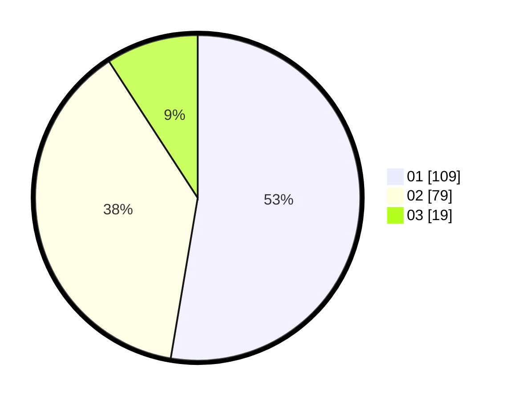

# Hasil

Hasil perolehan suara paslon dapat dilihat pada file paslon-01.txt, paslon-02.txt, dan paslon-03.txt.

Jika tidak ada, artinya data tersebut belum ada pada SIREKAP.

## Perolehan Suara

 * Paslon 01: **109**.
 * Paslon 02: **79**.
 * Paslon 03: **19**.

## Foto C Plano

https://sirekap-obj-formc.kpu.go.id/d170/pemilu/ppwp/31/75/02/10/01/3175021001033-20240215-233342--1cc28921-3ade-4434-a6c9-78d59a5b5ea7.jpg

https://sirekap-obj-formc.kpu.go.id/d170/pemilu/ppwp/31/75/02/10/01/3175021001033-20240215-233345--4b7554a4-55d5-4391-8afa-a835ad45a111.jpg

https://sirekap-obj-formc.kpu.go.id/d170/pemilu/ppwp/31/75/02/10/01/3175021001033-20240215-233344--2ad079c3-247f-4a3f-a473-178b06e358a6.jpg

## DATA PEMILIH TETAP

Jumlah pemilih dalam DPT: **207**.
 * L: **100**.
 * P: **107**.

## DATA PENGGUNA HAK PILIH

Jumlah pengguna hak pilih dalam DPT: **207**.
 * L: **100**.
 * P: **107**.

Jumlah pengguna hak pilih dalam DPTb: **0**.
 * L: **0**.
 * P: **0**.

Jumlah pengguna hak pilih dalam DPK: **0**.
 * L: **0**.
 * P: **0**.

Jumlah pengguna hak pilih: **207**.
 * L: **100**.
 * P: **107**.

## JUMLAH SUARA SAH DAN TIDAK SAH

JUMLAH SELURUH SUARA SAH: **207**.

JUMLAH SUARA TIDAK SAH: **0**.

JUMLAH SELURUH SUARA SAH DAN SUARA TIDAK SAH: **207**.
