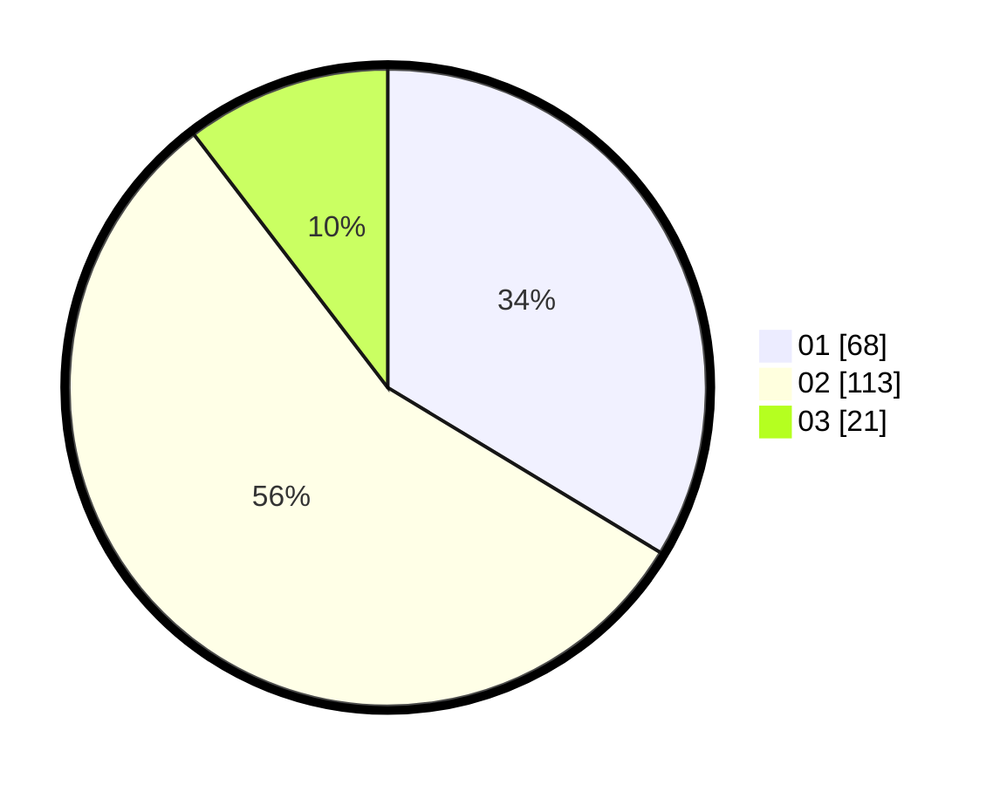

# Hasil

Hasil perolehan suara paslon dapat dilihat pada file paslon-01.txt, paslon-02.txt, dan paslon-03.txt.

Jika tidak ada, artinya data tersebut belum ada pada SIREKAP.

## Perolehan Suara

 * Paslon 01: **68**.
 * Paslon 02: **113**.
 * Paslon 03: **21**.

## Foto C Plano

https://sirekap-obj-formc.kpu.go.id/b10a/pemilu/ppwp/31/75/02/10/01/3175021001034-20240215-210257--01870b84-e74f-4555-84f2-1831a383170b.jpg

https://sirekap-obj-formc.kpu.go.id/b10a/pemilu/ppwp/31/75/02/10/01/3175021001034-20240215-210259--c934d3ed-ba67-4656-bcdd-63fab5830ca5.jpg

https://sirekap-obj-formc.kpu.go.id/b10a/pemilu/ppwp/31/75/02/10/01/3175021001034-20240215-210258--3b236083-b5c3-4152-8b97-9e5162b18e46.jpg

## DATA PEMILIH TETAP

Jumlah pemilih dalam DPT: **279**.
 * L: **140**.
 * P: **139**.

## DATA PENGGUNA HAK PILIH

Jumlah pengguna hak pilih dalam DPT: **207**.
 * L: **96**.
 * P: **111**.

Jumlah pengguna hak pilih dalam DPTb: **0**.
 * L: **0**.
 * P: **0**.

Jumlah pengguna hak pilih dalam DPK: **0**.
 * L: **0**.
 * P: **0**.

Jumlah pengguna hak pilih: **207**.
 * L: **96**.
 * P: **111**.

## JUMLAH SUARA SAH DAN TIDAK SAH

JUMLAH SELURUH SUARA SAH: **202**.

JUMLAH SUARA TIDAK SAH: **5**.

JUMLAH SELURUH SUARA SAH DAN SUARA TIDAK SAH: **207**.
