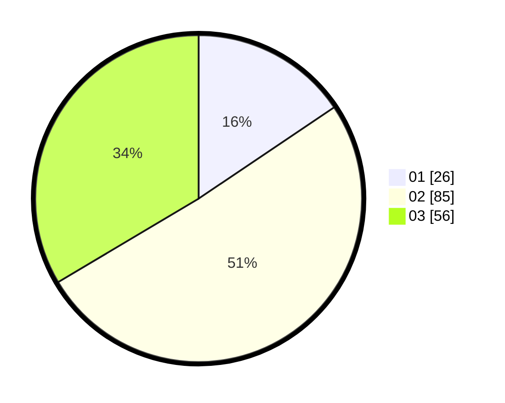

# Hasil

Hasil perolehan suara paslon dapat dilihat pada file paslon-01.txt, paslon-02.txt, dan paslon-03.txt.

Jika tidak ada, artinya data tersebut belum ada pada SIREKAP.

## Perolehan Suara

 * Paslon 01: **26**.
 * Paslon 02: **85**.
 * Paslon 03: **56**.

## Foto C Plano

https://sirekap-obj-formc.kpu.go.id/7379/pemilu/ppwp/31/75/02/10/01/3175021001042-20240214-231115--59419fb1-8c18-44b0-a47e-225cf9253482.jpg

https://sirekap-obj-formc.kpu.go.id/7379/pemilu/ppwp/31/75/02/10/01/3175021001042-20240214-231504--df79fc1b-44fa-4872-9452-70926f81abe3.jpg

https://sirekap-obj-formc.kpu.go.id/7379/pemilu/ppwp/31/75/02/10/01/3175021001042-20240214-231556--bb546a21-bccd-46df-a3b9-c83584a86ce1.jpg
