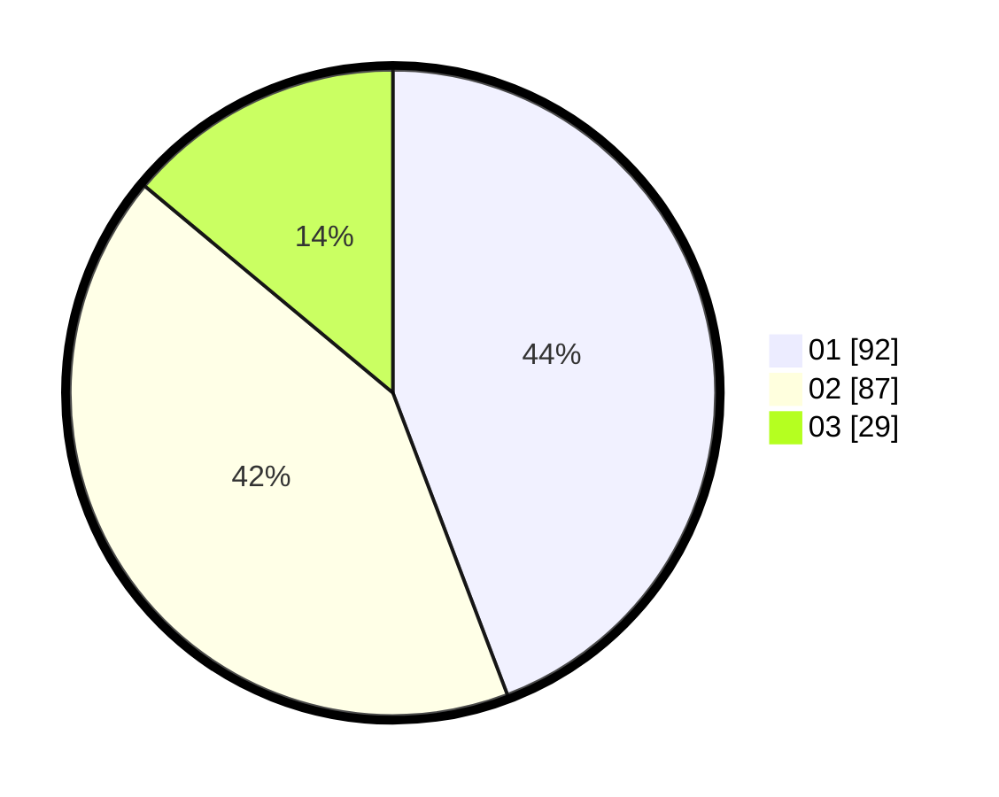

# Hasil

Hasil perolehan suara paslon dapat dilihat pada file paslon-01.txt, paslon-02.txt, dan paslon-03.txt.

Jika tidak ada, artinya data tersebut belum ada pada SIREKAP.

## Perolehan Suara

 * Paslon 01: **92**.
 * Paslon 02: **87**.
 * Paslon 03: **29**.

## Foto C Plano

https://sirekap-obj-formc.kpu.go.id/c998/pemilu/ppwp/31/75/02/10/01/3175021001047-20240214-214611--8219e81b-4363-42e7-83c7-3ed1f56b0ccb.jpg

https://sirekap-obj-formc.kpu.go.id/c998/pemilu/ppwp/31/75/02/10/01/3175021001047-20240214-214635--705ca8dc-7fd0-4cb3-9315-c08b0b11e3ad.jpg

https://sirekap-obj-formc.kpu.go.id/c998/pemilu/ppwp/31/75/02/10/01/3175021001047-20240214-214814--dad5cba2-20ec-41ad-9637-ad89cd64ee10.jpg
