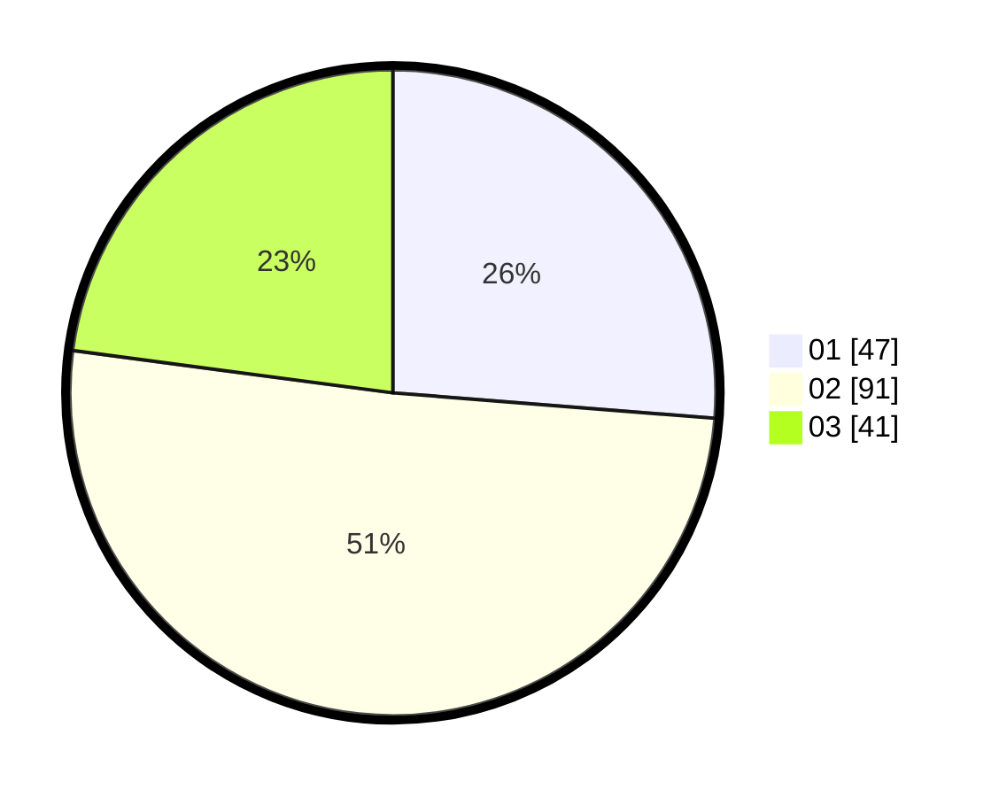

# Hasil

Hasil perolehan suara paslon dapat dilihat pada file paslon-01.txt, paslon-02.txt, dan paslon-03.txt.

Jika tidak ada, artinya data tersebut belum ada pada SIREKAP.

## Perolehan Suara

 * Paslon 01: **47**.
 * Paslon 02: **91**.
 * Paslon 03: **41**.

## Foto C Plano

https://sirekap-obj-formc.kpu.go.id/96a1/pemilu/ppwp/31/75/02/10/01/3175021001054-20240214-155135--a2dbf6b4-83d9-4e81-b062-de817e6d180c.jpg

https://sirekap-obj-formc.kpu.go.id/96a1/pemilu/ppwp/31/75/02/10/01/3175021001054-20240214-155439--fafbf111-9142-45e6-a1d5-e0663ec22e1c.jpg

https://sirekap-obj-formc.kpu.go.id/96a1/pemilu/ppwp/31/75/02/10/01/3175021001054-20240214-155532--da95a971-4390-492c-8edf-5df5e725c138.jpg

## DATA PEMILIH TETAP

Jumlah pemilih dalam DPT: **256**.
 * L: **136**.
 * P: **120**.

## DATA PENGGUNA HAK PILIH

Jumlah pengguna hak pilih dalam DPT: **190**.
 * L: **101**.
 * P: **89**.

Jumlah pengguna hak pilih dalam DPTb: **0**.
 * L: **0**.
 * P: **0**.

Jumlah pengguna hak pilih dalam DPK: **1**.
 * L: **0**.
 * P: **1**.

Jumlah pengguna hak pilih: **191**.
 * L: **101**.
 * P: **90**.

## JUMLAH SUARA SAH DAN TIDAK SAH

JUMLAH SELURUH SUARA SAH: **179**.

JUMLAH SUARA TIDAK SAH: **12**.

JUMLAH SELURUH SUARA SAH DAN SUARA TIDAK SAH: **191**.
