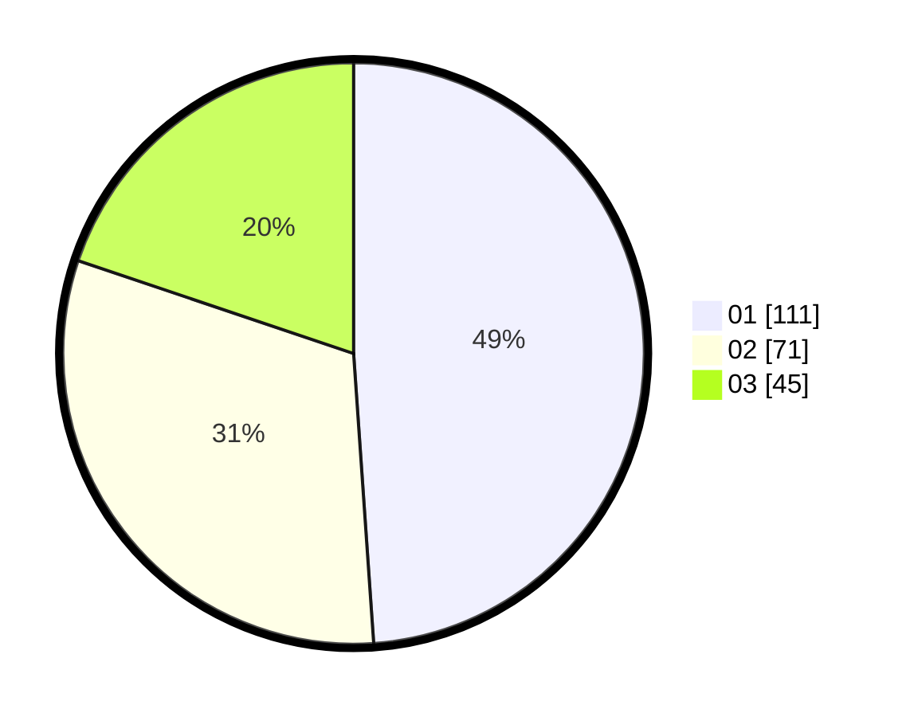

# Hasil

Hasil perolehan suara paslon dapat dilihat pada file paslon-01.txt, paslon-02.txt, dan paslon-03.txt.

Jika tidak ada, artinya data tersebut belum ada pada SIREKAP.

## Perolehan Suara

 * Paslon 01: **111**.
 * Paslon 02: **71**.
 * Paslon 03: **45**.

## Foto C Plano

https://sirekap-obj-formc.kpu.go.id/eb38/pemilu/ppwp/31/75/02/10/01/3175021001062-20240214-205801--e5b9e276-cd47-408c-a5c8-96bacbe5c5a0.jpg

https://sirekap-obj-formc.kpu.go.id/eb38/pemilu/ppwp/31/75/02/10/01/3175021001062-20240214-201128--3de72351-0c2a-4005-b1b5-b15455a520f7.jpg

https://sirekap-obj-formc.kpu.go.id/eb38/pemilu/ppwp/31/75/02/10/01/3175021001062-20240214-201339--8b449692-49a6-489f-87f0-6ed2309d9550.jpg

## DATA PEMILIH TETAP

Jumlah pemilih dalam DPT: **283**.
 * L: **134**.
 * P: **149**.

## DATA PENGGUNA HAK PILIH

Jumlah pengguna hak pilih dalam DPT: **223**.
 * L: **106**.
 * P: **117**.

Jumlah pengguna hak pilih dalam DPTb: **4**.
 * L: **2**.
 * P: **2**.

Jumlah pengguna hak pilih dalam DPK: **2**.
 * L: **1**.
 * P: **1**.

Jumlah pengguna hak pilih: **229**.
 * L: **109**.
 * P: **120**.

## JUMLAH SUARA SAH DAN TIDAK SAH

JUMLAH SELURUH SUARA SAH: **227**.

JUMLAH SUARA TIDAK SAH: **2**.

JUMLAH SELURUH SUARA SAH DAN SUARA TIDAK SAH: **229**.
