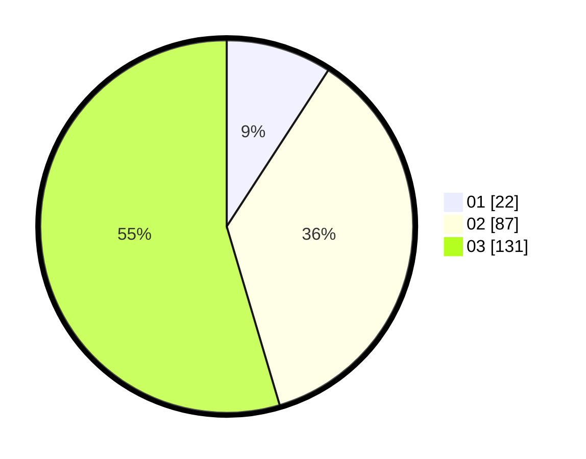

# Hasil

Hasil perolehan suara paslon dapat dilihat pada file paslon-01.txt, paslon-02.txt, dan paslon-03.txt.

Jika tidak ada, artinya data tersebut belum ada pada SIREKAP.

## Perolehan Suara

 * Paslon 01: **22**.
 * Paslon 02: **87**.
 * Paslon 03: **131**.

## Foto C Plano

https://sirekap-obj-formc.kpu.go.id/fba2/pemilu/ppwp/31/75/02/10/01/3175021001072-20240216-141342--8c039214-1ffd-4dc3-99c0-3cf74339e81f.jpg

https://sirekap-obj-formc.kpu.go.id/fba2/pemilu/ppwp/31/75/02/10/01/3175021001072-20240216-141343--fb41e4b6-6b82-4af4-bb50-7fac369bd8e4.jpg

https://sirekap-obj-formc.kpu.go.id/fba2/pemilu/ppwp/31/75/02/10/01/3175021001072-20240216-141342--8dfe65b6-8589-44eb-9611-ebca5b89a23a.jpg

## DATA PEMILIH TETAP

Jumlah pemilih dalam DPT: **278**.
 * L: **138**.
 * P: **140**.

## DATA PENGGUNA HAK PILIH

Jumlah pengguna hak pilih dalam DPT: **201**.
 * L: **100**.
 * P: **101**.

Jumlah pengguna hak pilih dalam DPTb: **10**.
 * L: **2**.
 * P: **8**.

Jumlah pengguna hak pilih dalam DPK: **30**.
 * L: **13**.
 * P: **17**.

Jumlah pengguna hak pilih: **241**.
 * L: **115**.
 * P: **126**.

## JUMLAH SUARA SAH DAN TIDAK SAH

JUMLAH SELURUH SUARA SAH: **240**.

JUMLAH SUARA TIDAK SAH: **1**.

JUMLAH SELURUH SUARA SAH DAN SUARA TIDAK SAH: **241**.
