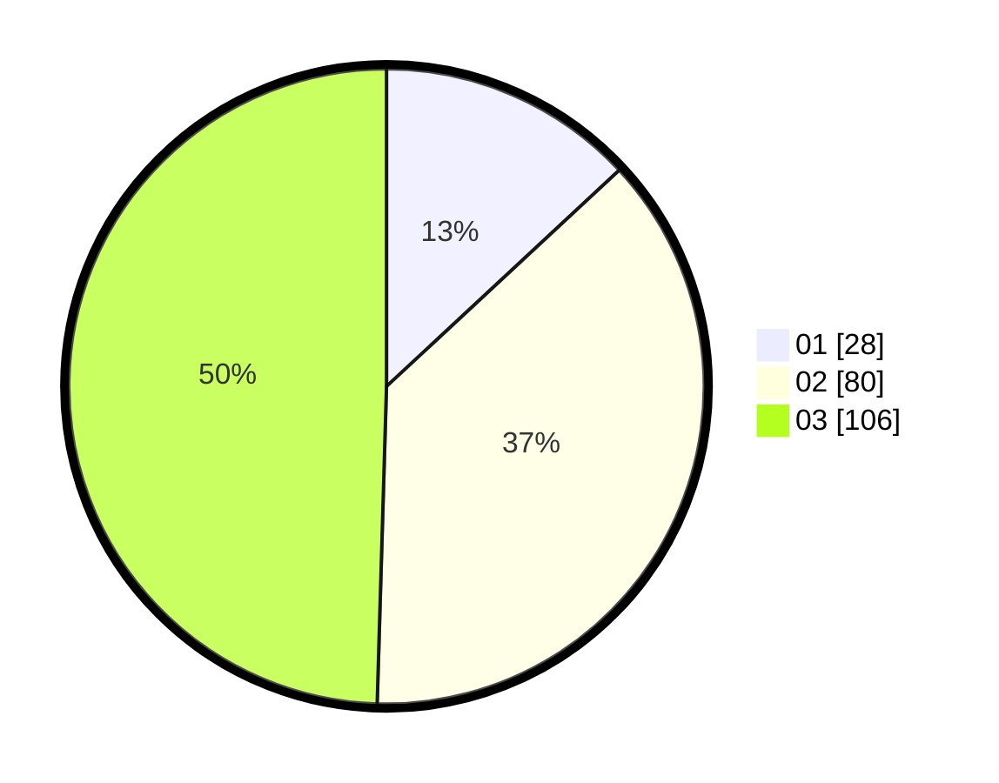

# Hasil

Hasil perolehan suara paslon dapat dilihat pada file paslon-01.txt, paslon-02.txt, dan paslon-03.txt.

Jika tidak ada, artinya data tersebut belum ada pada SIREKAP.

## Perolehan Suara

 * Paslon 01: **28**.
 * Paslon 02: **80**.
 * Paslon 03: **106**.

## Foto C Plano

https://sirekap-obj-formc.kpu.go.id/cb4e/pemilu/ppwp/31/75/02/10/01/3175021001078-20240215-133405--13f9668a-8e56-4782-9b89-e0826ffd337d.jpg

https://sirekap-obj-formc.kpu.go.id/cb4e/pemilu/ppwp/31/75/02/10/01/3175021001078-20240215-133358--73f56ceb-9cf5-437c-8015-f6ccc6f790ca.jpg

https://sirekap-obj-formc.kpu.go.id/cb4e/pemilu/ppwp/31/75/02/10/01/3175021001078-20240215-133407--3456184a-4b6e-4989-8dbd-e994f4384d0b.jpg
