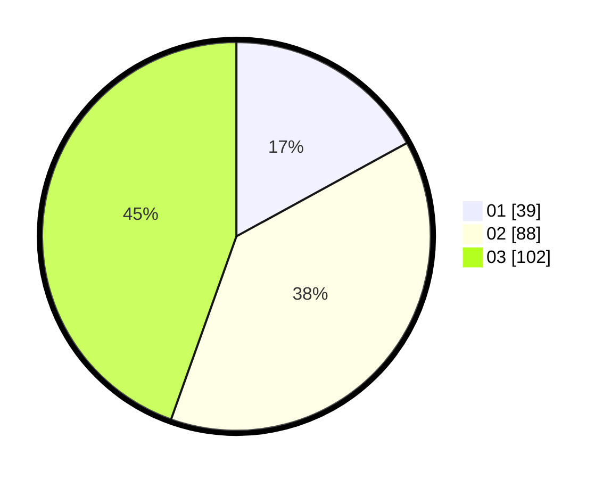

# Hasil

Hasil perolehan suara paslon dapat dilihat pada file paslon-01.txt, paslon-02.txt, dan paslon-03.txt.

Jika tidak ada, artinya data tersebut belum ada pada SIREKAP.

## Perolehan Suara

 * Paslon 01: **39**.
 * Paslon 02: **88**.
 * Paslon 03: **102**.

## Foto C Plano

https://sirekap-obj-formc.kpu.go.id/68ea/pemilu/ppwp/31/75/02/10/01/3175021001080-20240214-200441--2eee7c64-9454-4e73-906b-433d3865ce79.jpg

https://sirekap-obj-formc.kpu.go.id/68ea/pemilu/ppwp/31/75/02/10/01/3175021001080-20240214-200536--1d65771d-361e-4dea-bd40-b3d52ed3bb09.jpg

https://sirekap-obj-formc.kpu.go.id/68ea/pemilu/ppwp/31/75/02/10/01/3175021001080-20240214-200629--39a5703b-30cd-4709-978f-6cf289257750.jpg

## DATA PEMILIH TETAP

Jumlah pemilih dalam DPT: **286**.
 * L: **130**.
 * P: **156**.

## DATA PENGGUNA HAK PILIH

Jumlah pengguna hak pilih dalam DPT: **210**.
 * L: **93**.
 * P: **117**.

Jumlah pengguna hak pilih dalam DPTb: **0**.
 * L: **0**.
 * P: **0**.

Jumlah pengguna hak pilih dalam DPK: **19**.
 * L: **9**.
 * P: **10**.

Jumlah pengguna hak pilih: **229**.
 * L: **102**.
 * P: **127**.

## JUMLAH SUARA SAH DAN TIDAK SAH

JUMLAH SELURUH SUARA SAH: **229**.

JUMLAH SUARA TIDAK SAH: **1**.

JUMLAH SELURUH SUARA SAH DAN SUARA TIDAK SAH: **230**.
