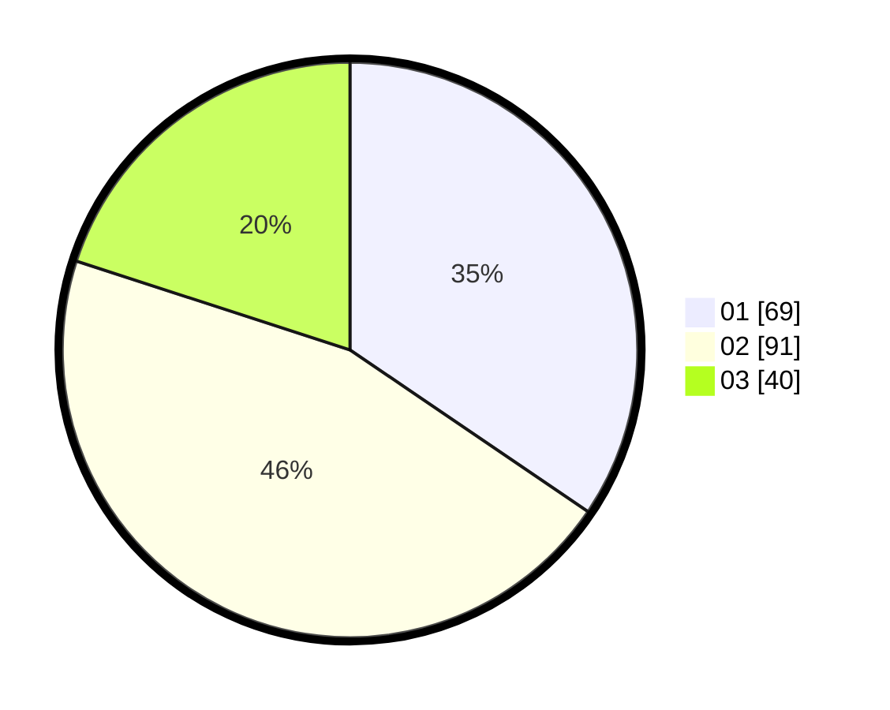

# Hasil

Hasil perolehan suara paslon dapat dilihat pada file paslon-01.txt, paslon-02.txt, dan paslon-03.txt.

Jika tidak ada, artinya data tersebut belum ada pada SIREKAP.

## Perolehan Suara

 * Paslon 01: **69**.
 * Paslon 02: **91**.
 * Paslon 03: **40**.

## Foto C Plano

https://sirekap-obj-formc.kpu.go.id/3bb3/pemilu/ppwp/31/75/02/10/01/3175021001092-20240214-175311--6e9f6f44-2d17-49c1-89e2-f42c082a031d.jpg

https://sirekap-obj-formc.kpu.go.id/3bb3/pemilu/ppwp/31/75/02/10/01/3175021001092-20240214-175314--5c0f9999-b0a4-428b-a311-96deb0243b46.jpg

https://sirekap-obj-formc.kpu.go.id/3bb3/pemilu/ppwp/31/75/02/10/01/3175021001092-20240214-175313--08cb3dd5-47fc-4195-8b9e-faa650176be9.jpg

## DATA PEMILIH TETAP

Jumlah pemilih dalam DPT: **275**.
 * L: **144**.
 * P: **131**.

## DATA PENGGUNA HAK PILIH

Jumlah pengguna hak pilih dalam DPT: **202**.
 * L: **98**.
 * P: **104**.

Jumlah pengguna hak pilih dalam DPTb: **0**.
 * L: **0**.
 * P: **0**.

Jumlah pengguna hak pilih dalam DPK: **2**.
 * L: **2**.
 * P: **0**.

Jumlah pengguna hak pilih: **204**.
 * L: **100**.
 * P: **104**.

## JUMLAH SUARA SAH DAN TIDAK SAH

JUMLAH SELURUH SUARA SAH: **200**.

JUMLAH SUARA TIDAK SAH: **4**.

JUMLAH SELURUH SUARA SAH DAN SUARA TIDAK SAH: **204**.
