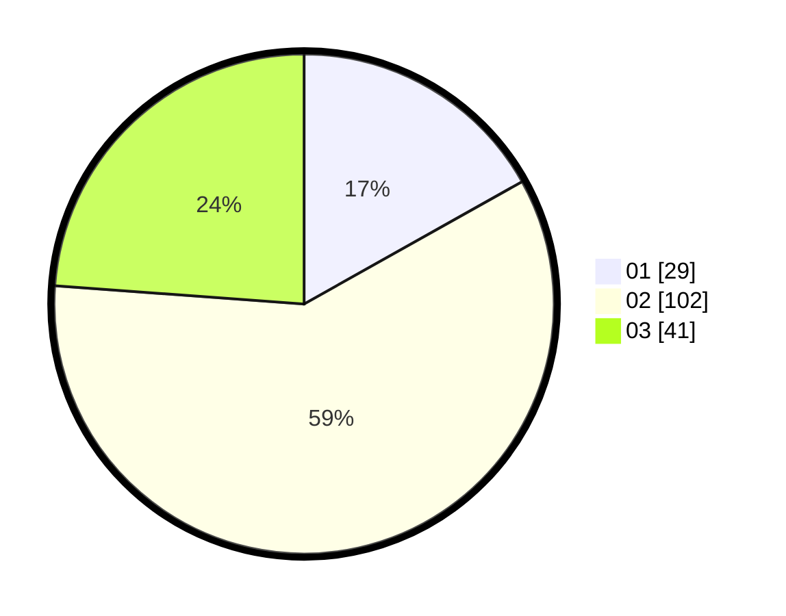

# Hasil

Hasil perolehan suara paslon dapat dilihat pada file paslon-01.txt, paslon-02.txt, dan paslon-03.txt.

Jika tidak ada, artinya data tersebut belum ada pada SIREKAP.

## Perolehan Suara

 * Paslon 01: **29**.
 * Paslon 02: **102**.
 * Paslon 03: **41**.

## Foto C Plano

https://sirekap-obj-formc.kpu.go.id/a00f/pemilu/ppwp/31/75/02/10/01/3175021001094-20240214-155136--9ffdbb46-67d5-43c1-a936-902721eb9477.jpg

https://sirekap-obj-formc.kpu.go.id/a00f/pemilu/ppwp/31/75/02/10/01/3175021001094-20240214-190012--65f0b433-bba0-4926-b70e-38454099447b.jpg

https://sirekap-obj-formc.kpu.go.id/a00f/pemilu/ppwp/31/75/02/10/01/3175021001094-20240214-185203--bb734553-d1ab-48d3-96d2-58262c650f06.jpg
