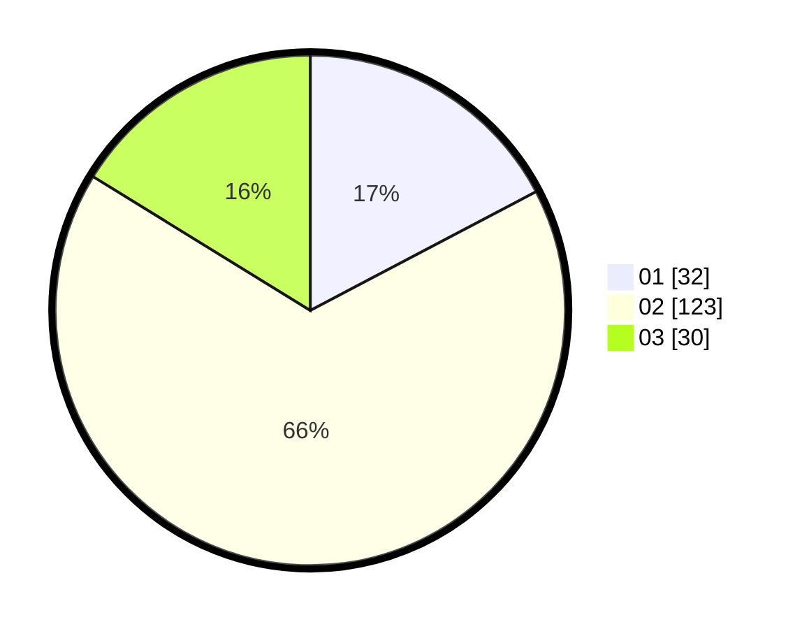

# Hasil

Hasil perolehan suara paslon dapat dilihat pada file paslon-01.txt, paslon-02.txt, dan paslon-03.txt.

Jika tidak ada, artinya data tersebut belum ada pada SIREKAP.

## Perolehan Suara

 * Paslon 01: **32**.
 * Paslon 02: **123**.
 * Paslon 03: **30**.

## Foto C Plano

https://sirekap-obj-formc.kpu.go.id/32b7/pemilu/ppwp/31/75/02/10/01/3175021001097-20240214-202343--dc5db612-f853-44fa-989b-6b211dda30af.jpg

https://sirekap-obj-formc.kpu.go.id/32b7/pemilu/ppwp/31/75/02/10/01/3175021001097-20240214-202433--b924a0e8-7b27-4b53-aaba-3e6ace6265d9.jpg

https://sirekap-obj-formc.kpu.go.id/32b7/pemilu/ppwp/31/75/02/10/01/3175021001097-20240214-221505--37e2921e-af72-4c29-9308-a3a96e4516ab.jpg

## DATA PEMILIH TETAP

Jumlah pemilih dalam DPT: **276**.
 * L: **145**.
 * P: **131**.

## DATA PENGGUNA HAK PILIH

Jumlah pengguna hak pilih dalam DPT: **185**.
 * L: **100**.
 * P: **85**.

Jumlah pengguna hak pilih dalam DPTb: **0**.
 * L: **0**.
 * P: **0**.

Jumlah pengguna hak pilih dalam DPK: **0**.
 * L: **0**.
 * P: **0**.

Jumlah pengguna hak pilih: **185**.
 * L: **100**.
 * P: **85**.

## JUMLAH SUARA SAH DAN TIDAK SAH

JUMLAH SELURUH SUARA SAH: **162**.

JUMLAH SUARA TIDAK SAH: **23**.

JUMLAH SELURUH SUARA SAH DAN SUARA TIDAK SAH: **185**.
