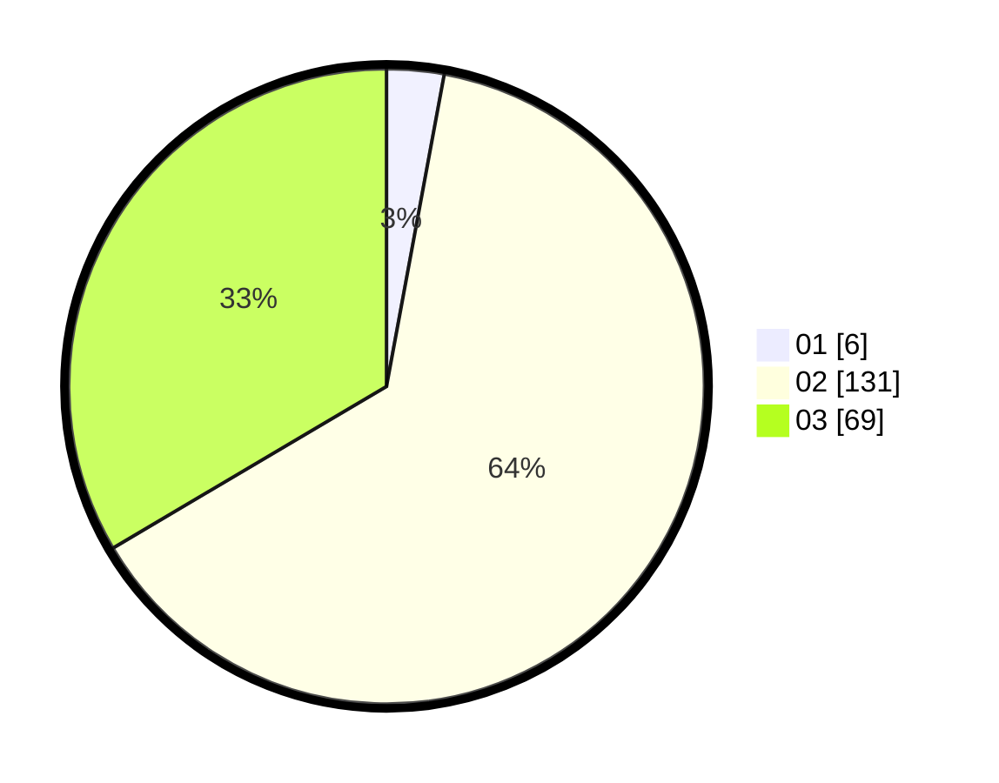

# Hasil

Hasil perolehan suara paslon dapat dilihat pada file paslon-01.txt, paslon-02.txt, dan paslon-03.txt.

Jika tidak ada, artinya data tersebut belum ada pada SIREKAP.

## Perolehan Suara

 * Paslon 01: **6**.
 * Paslon 02: **131**.
 * Paslon 03: **69**.

## Foto C Plano

https://sirekap-obj-formc.kpu.go.id/8c1d/pemilu/ppwp/31/75/02/10/01/3175021001103-20240214-210743--0861a9aa-f1f2-44f9-9af8-4417ac6831ef.jpg

https://sirekap-obj-formc.kpu.go.id/8c1d/pemilu/ppwp/31/75/02/10/01/3175021001103-20240214-210954--6b77c293-eca4-4ed4-8b07-710733fdfd14.jpg

https://sirekap-obj-formc.kpu.go.id/8c1d/pemilu/ppwp/31/75/02/10/01/3175021001103-20240214-211057--bf2bb7f6-ca87-4146-b332-32624bd21987.jpg
