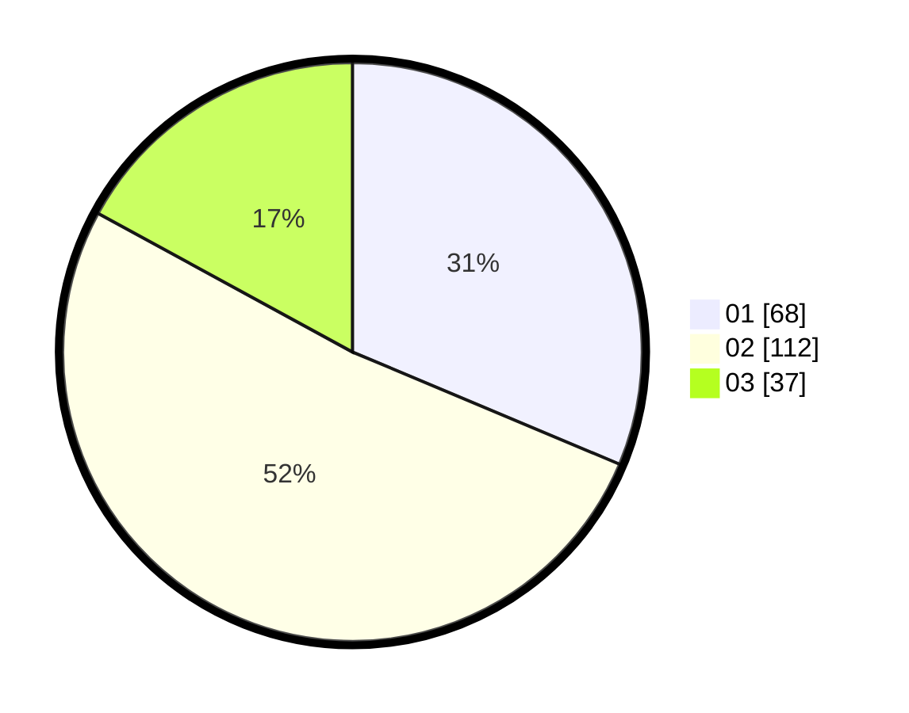

# Hasil

Hasil perolehan suara paslon dapat dilihat pada file paslon-01.txt, paslon-02.txt, dan paslon-03.txt.

Jika tidak ada, artinya data tersebut belum ada pada SIREKAP.

## Perolehan Suara

 * Paslon 01: **68**.
 * Paslon 02: **112**.
 * Paslon 03: **37**.

## Foto C Plano

https://sirekap-obj-formc.kpu.go.id/85dc/pemilu/ppwp/31/75/02/10/02/3175021002002-20240214-200449--a34cb591-bc30-4338-a861-cb1958cb58dc.jpg

https://sirekap-obj-formc.kpu.go.id/85dc/pemilu/ppwp/31/75/02/10/02/3175021002002-20240216-011507--0dea1180-ddd4-4a90-9c15-a2efd0140fb8.jpg

https://sirekap-obj-formc.kpu.go.id/85dc/pemilu/ppwp/31/75/02/10/02/3175021002002-20240216-011905--670482b9-280b-4a13-ae2e-94e6234a6f84.jpg

## DATA PEMILIH TETAP

Jumlah pemilih dalam DPT: **262**.
 * L: **133**.
 * P: **129**.

## DATA PENGGUNA HAK PILIH

Jumlah pengguna hak pilih dalam DPT: **208**.
 * L: **108**.
 * P: **800**.

Jumlah pengguna hak pilih dalam DPTb: **12**.
 * L: **8**.
 * P: **4**.

Jumlah pengguna hak pilih dalam DPK: **0**.
 * L: **0**.
 * P: **0**.

Jumlah pengguna hak pilih: **220**.
 * L: **116**.
 * P: **104**.

## JUMLAH SUARA SAH DAN TIDAK SAH

JUMLAH SELURUH SUARA SAH: **217**.

JUMLAH SUARA TIDAK SAH: **3**.

JUMLAH SELURUH SUARA SAH DAN SUARA TIDAK SAH: **220**.
