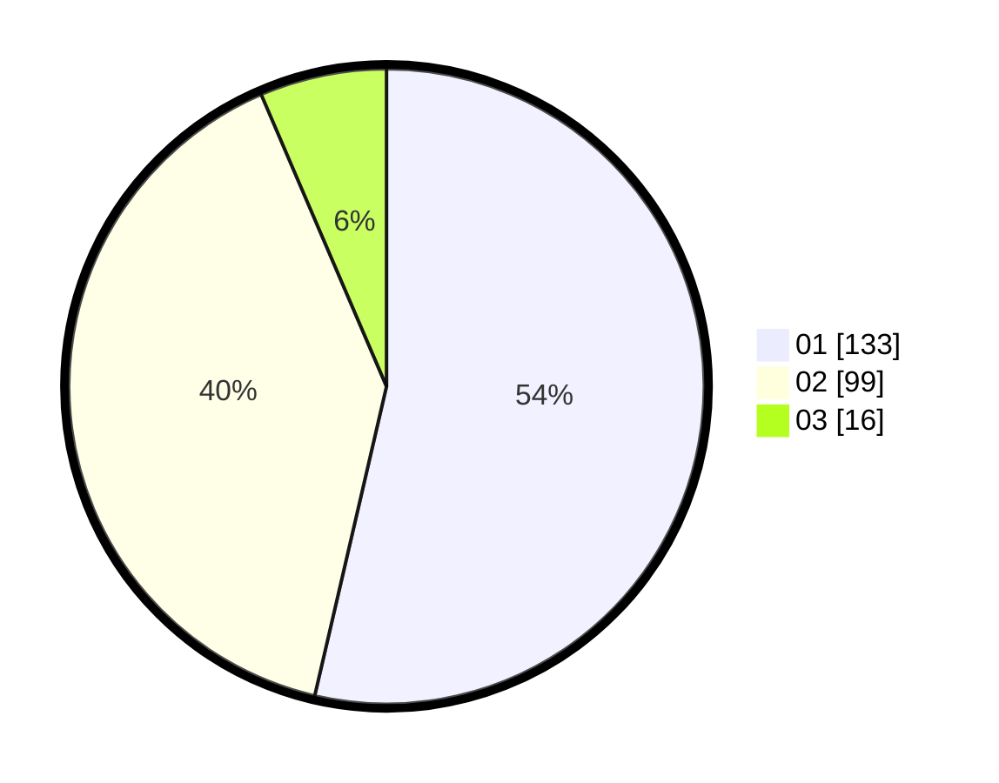

# Hasil

Hasil perolehan suara paslon dapat dilihat pada file paslon-01.txt, paslon-02.txt, dan paslon-03.txt.

Jika tidak ada, artinya data tersebut belum ada pada SIREKAP.

## Perolehan Suara

 * Paslon 01: **133**.
 * Paslon 02: **99**.
 * Paslon 03: **16**.

## Foto C Plano

https://sirekap-obj-formc.kpu.go.id/7f70/pemilu/ppwp/31/75/02/10/02/3175021002003-20240215-230148--b4bda118-b1a7-4993-b918-5d2b6d9393bf.jpg

https://sirekap-obj-formc.kpu.go.id/7f70/pemilu/ppwp/31/75/02/10/02/3175021002003-20240215-230150--28cca559-6f7e-4c67-a1d1-d8b30956fdb2.jpg

https://sirekap-obj-formc.kpu.go.id/7f70/pemilu/ppwp/31/75/02/10/02/3175021002003-20240215-230149--e619b6d0-77fb-4114-aa8d-6e28ac751cd7.jpg

## DATA PEMILIH TETAP

Jumlah pemilih dalam DPT: **274**.
 * L: **131**.
 * P: **143**.

## DATA PENGGUNA HAK PILIH

Jumlah pengguna hak pilih dalam DPT: **235**.
 * L: **111**.
 * P: **124**.

Jumlah pengguna hak pilih dalam DPTb: **16**.
 * L: **9**.
 * P: **7**.

Jumlah pengguna hak pilih dalam DPK: **0**.
 * L: **0**.
 * P: **0**.

Jumlah pengguna hak pilih: **251**.
 * L: **120**.
 * P: **131**.

## JUMLAH SUARA SAH DAN TIDAK SAH

JUMLAH SELURUH SUARA SAH: **248**.

JUMLAH SUARA TIDAK SAH: **3**.

JUMLAH SELURUH SUARA SAH DAN SUARA TIDAK SAH: **251**.
