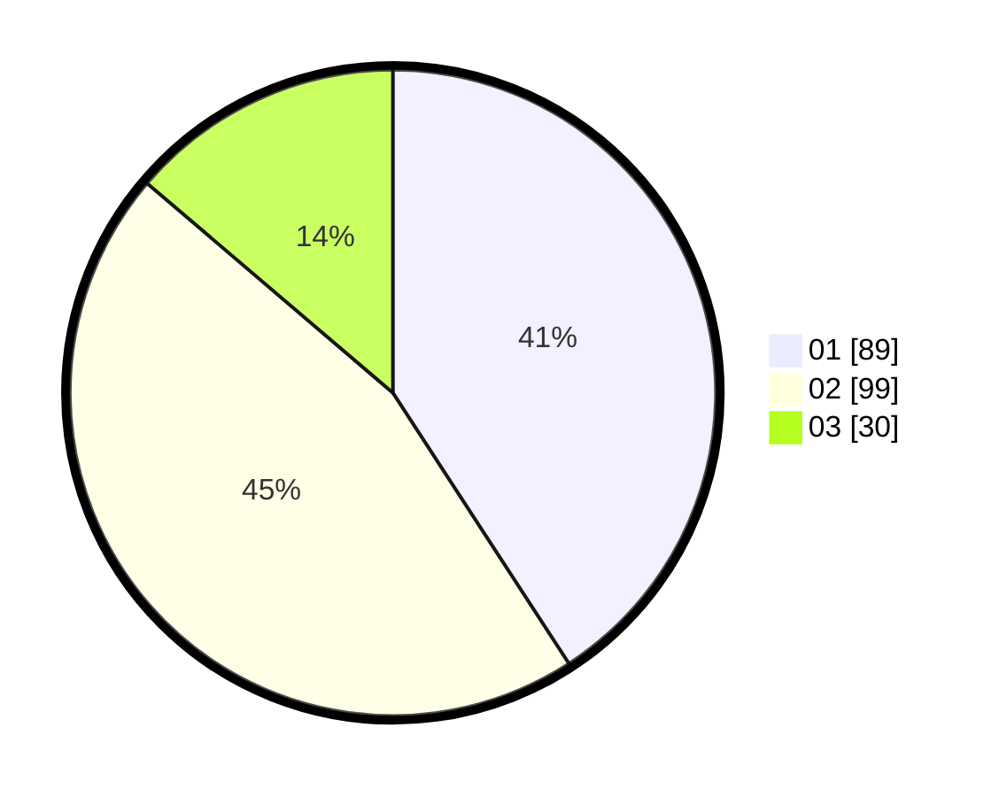

# Hasil

Hasil perolehan suara paslon dapat dilihat pada file paslon-01.txt, paslon-02.txt, dan paslon-03.txt.

Jika tidak ada, artinya data tersebut belum ada pada SIREKAP.

## Perolehan Suara

 * Paslon 01: **89**.
 * Paslon 02: **99**.
 * Paslon 03: **30**.

## Foto C Plano

https://sirekap-obj-formc.kpu.go.id/9cfc/pemilu/ppwp/31/75/02/10/02/3175021002004-20240214-192536--2e1a3465-a296-4b63-a602-59436a64fe6d.jpg

https://sirekap-obj-formc.kpu.go.id/9cfc/pemilu/ppwp/31/75/02/10/02/3175021002004-20240214-220910--9126e190-bbe9-4d2b-8f96-fce2fccc5ff9.jpg

https://sirekap-obj-formc.kpu.go.id/9cfc/pemilu/ppwp/31/75/02/10/02/3175021002004-20240214-221124--ec9e5ea2-aa43-48c9-8eb7-da222ba9cd25.jpg

## DATA PEMILIH TETAP

Jumlah pemilih dalam DPT: **287**.
 * L: **148**.
 * P: **139**.

## DATA PENGGUNA HAK PILIH

Jumlah pengguna hak pilih dalam DPT: **220**.
 * L: **111**.
 * P: **109**.

Jumlah pengguna hak pilih dalam DPTb: **0**.
 * L: **0**.
 * P: **0**.

Jumlah pengguna hak pilih dalam DPK: **0**.
 * L: **0**.
 * P: **0**.

Jumlah pengguna hak pilih: **220**.
 * L: **111**.
 * P: **109**.

## JUMLAH SUARA SAH DAN TIDAK SAH

JUMLAH SELURUH SUARA SAH: **218**.

JUMLAH SUARA TIDAK SAH: **2**.

JUMLAH SELURUH SUARA SAH DAN SUARA TIDAK SAH: **220**.
