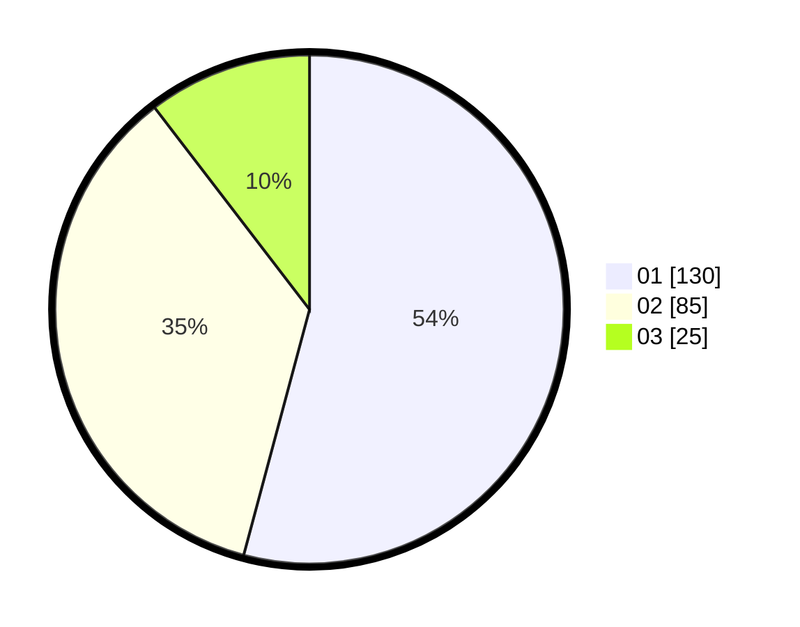

# Hasil

Hasil perolehan suara paslon dapat dilihat pada file paslon-01.txt, paslon-02.txt, dan paslon-03.txt.

Jika tidak ada, artinya data tersebut belum ada pada SIREKAP.

## Perolehan Suara

 * Paslon 01: **130**.
 * Paslon 02: **85**.
 * Paslon 03: **25**.

## Foto C Plano

https://sirekap-obj-formc.kpu.go.id/e361/pemilu/ppwp/31/75/02/10/02/3175021002011-20240216-121726--70abdfcf-229c-458e-a894-89753b55467a.jpg

https://sirekap-obj-formc.kpu.go.id/e361/pemilu/ppwp/31/75/02/10/02/3175021002011-20240216-121729--6e50365d-110d-41c9-afa0-5369bea73b9a.jpg

https://sirekap-obj-formc.kpu.go.id/e361/pemilu/ppwp/31/75/02/10/02/3175021002011-20240214-155506--dd074ee0-91d8-4d22-94d2-f0fac5931368.jpg

## DATA PEMILIH TETAP

Jumlah pemilih dalam DPT: **295**.
 * L: **141**.
 * P: **154**.

## DATA PENGGUNA HAK PILIH

Jumlah pengguna hak pilih dalam DPT: **239**.
 * L: **112**.
 * P: **127**.

Jumlah pengguna hak pilih dalam DPTb: **6**.
 * L: **2**.
 * P: **4**.

Jumlah pengguna hak pilih dalam DPK: **2**.
 * L: **0**.
 * P: **2**.

Jumlah pengguna hak pilih: **247**.
 * L: **114**.
 * P: **133**.

## JUMLAH SUARA SAH DAN TIDAK SAH

JUMLAH SELURUH SUARA SAH: **240**.

JUMLAH SUARA TIDAK SAH: **7**.

JUMLAH SELURUH SUARA SAH DAN SUARA TIDAK SAH: **247**.
