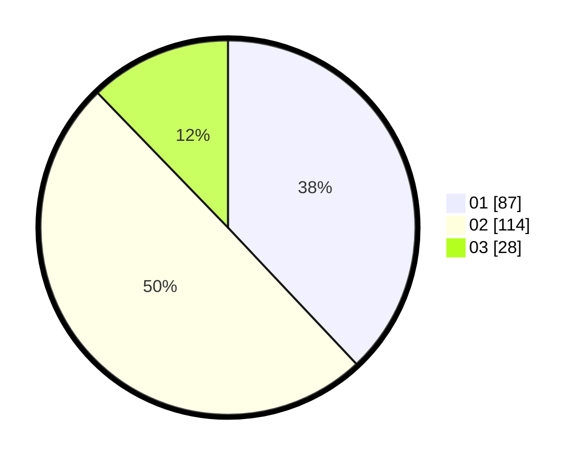

# Hasil

Hasil perolehan suara paslon dapat dilihat pada file paslon-01.txt, paslon-02.txt, dan paslon-03.txt.

Jika tidak ada, artinya data tersebut belum ada pada SIREKAP.

## Perolehan Suara

 * Paslon 01: **87**.
 * Paslon 02: **114**.
 * Paslon 03: **28**.

## Foto C Plano

https://sirekap-obj-formc.kpu.go.id/74c5/pemilu/ppwp/31/75/02/10/02/3175021002015-20240215-002311--e91e200c-1d40-4684-8145-ccca179ffe80.jpg

https://sirekap-obj-formc.kpu.go.id/74c5/pemilu/ppwp/31/75/02/10/02/3175021002015-20240214-230050--e7bd994d-be79-4766-a686-d48c9ab7be83.jpg

https://sirekap-obj-formc.kpu.go.id/74c5/pemilu/ppwp/31/75/02/10/02/3175021002015-20240215-002641--6a1ea133-7e4d-4de2-a992-ea2f0393d445.jpg
