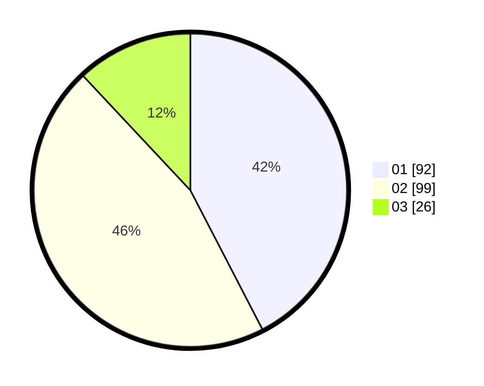

# Hasil

Hasil perolehan suara paslon dapat dilihat pada file paslon-01.txt, paslon-02.txt, dan paslon-03.txt.

Jika tidak ada, artinya data tersebut belum ada pada SIREKAP.

## Perolehan Suara

 * Paslon 01: **92**.
 * Paslon 02: **99**.
 * Paslon 03: **26**.

## Foto C Plano

https://sirekap-obj-formc.kpu.go.id/495c/pemilu/ppwp/31/75/02/10/02/3175021002017-20240217-182210--97591bad-bf73-4054-92e1-3e55b591ca26.jpg

https://sirekap-obj-formc.kpu.go.id/495c/pemilu/ppwp/31/75/02/10/02/3175021002017-20240217-182211--70ed602a-1dd4-4db6-92cd-56befd2d0943.jpg

https://sirekap-obj-formc.kpu.go.id/495c/pemilu/ppwp/31/75/02/10/02/3175021002017-20240217-182210--3347a6b3-78f9-4aef-8d70-28ce6478a262.jpg

## DATA PEMILIH TETAP

Jumlah pemilih dalam DPT: **281**.
 * L: **142**.
 * P: **139**.

## DATA PENGGUNA HAK PILIH

Jumlah pengguna hak pilih dalam DPT: **213**.
 * L: **102**.
 * P: **111**.

Jumlah pengguna hak pilih dalam DPTb: **8**.
 * L: **7**.
 * P: **1**.

Jumlah pengguna hak pilih dalam DPK: **0**.
 * L: **0**.
 * P: **0**.

Jumlah pengguna hak pilih: **221**.
 * L: **109**.
 * P: **112**.

## JUMLAH SUARA SAH DAN TIDAK SAH

JUMLAH SELURUH SUARA SAH: **217**.

JUMLAH SUARA TIDAK SAH: **4**.

JUMLAH SELURUH SUARA SAH DAN SUARA TIDAK SAH: **221**.
