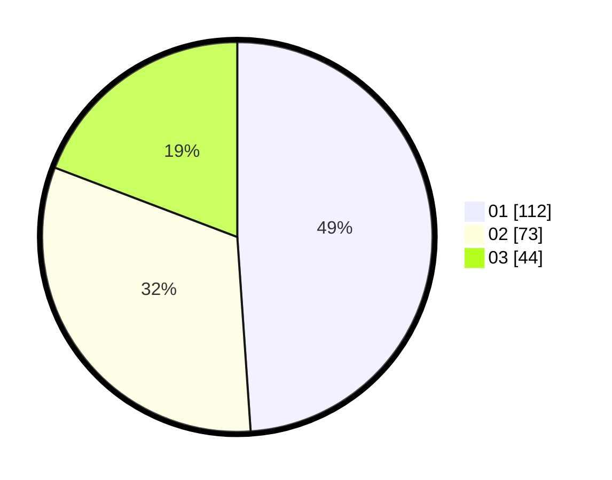

# Hasil

Hasil perolehan suara paslon dapat dilihat pada file paslon-01.txt, paslon-02.txt, dan paslon-03.txt.

Jika tidak ada, artinya data tersebut belum ada pada SIREKAP.

## Perolehan Suara

 * Paslon 01: **112**.
 * Paslon 02: **73**.
 * Paslon 03: **44**.

## Foto C Plano

https://sirekap-obj-formc.kpu.go.id/b09e/pemilu/ppwp/31/75/02/10/02/3175021002021-20240217-212654--d839393c-b160-497a-aced-8b6deac80e0a.jpg

https://sirekap-obj-formc.kpu.go.id/b09e/pemilu/ppwp/31/75/02/10/02/3175021002021-20240216-025501--d338be6a-5d9d-4710-9efa-b315f464f537.jpg

https://sirekap-obj-formc.kpu.go.id/b09e/pemilu/ppwp/31/75/02/10/02/3175021002021-20240216-025454--b4ffdd9f-f14f-4fdb-be26-fba1c43a144a.jpg

## DATA PEMILIH TETAP

Jumlah pemilih dalam DPT: **281**.
 * L: **148**.
 * P: **133**.

## DATA PENGGUNA HAK PILIH

Jumlah pengguna hak pilih dalam DPT: **227**.
 * L: **120**.
 * P: **107**.

Jumlah pengguna hak pilih dalam DPTb: **2**.
 * L: **2**.
 * P: **0**.

Jumlah pengguna hak pilih dalam DPK: **2**.
 * L: **1**.
 * P: **1**.

Jumlah pengguna hak pilih: **231**.
 * L: **123**.
 * P: **108**.

## JUMLAH SUARA SAH DAN TIDAK SAH

JUMLAH SELURUH SUARA SAH: **229**.

JUMLAH SUARA TIDAK SAH: **2**.

JUMLAH SELURUH SUARA SAH DAN SUARA TIDAK SAH: **231**.
