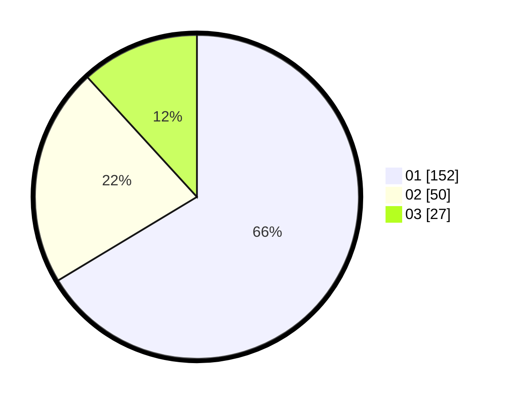

# Hasil

Hasil perolehan suara paslon dapat dilihat pada file paslon-01.txt, paslon-02.txt, dan paslon-03.txt.

Jika tidak ada, artinya data tersebut belum ada pada SIREKAP.

## Perolehan Suara

 * Paslon 01: **152**.
 * Paslon 02: **50**.
 * Paslon 03: **27**.

## Foto C Plano

https://sirekap-obj-formc.kpu.go.id/1434/pemilu/ppwp/31/75/02/10/02/3175021002022-20240215-061411--e52c16b8-3579-4070-8625-5fd5a8372893.jpg

https://sirekap-obj-formc.kpu.go.id/1434/pemilu/ppwp/31/75/02/10/02/3175021002022-20240215-061421--0ae3fb57-7f30-474a-8b74-7e8a8432c17d.jpg

https://sirekap-obj-formc.kpu.go.id/1434/pemilu/ppwp/31/75/02/10/02/3175021002022-20240214-155408--3bae4864-decb-4d06-99b0-f2d4f617d89b.jpg

## DATA PEMILIH TETAP

Jumlah pemilih dalam DPT: **265**.
 * L: **128**.
 * P: **137**.

## DATA PENGGUNA HAK PILIH

Jumlah pengguna hak pilih dalam DPT: **230**.
 * L: **108**.
 * P: **122**.

Jumlah pengguna hak pilih dalam DPTb: **5**.
 * L: **2**.
 * P: **3**.

Jumlah pengguna hak pilih dalam DPK: **1**.
 * L: **1**.
 * P: **0**.

Jumlah pengguna hak pilih: **236**.
 * L: **111**.
 * P: **125**.

## JUMLAH SUARA SAH DAN TIDAK SAH

JUMLAH SELURUH SUARA SAH: **229**.

JUMLAH SUARA TIDAK SAH: **7**.

JUMLAH SELURUH SUARA SAH DAN SUARA TIDAK SAH: **236**.
