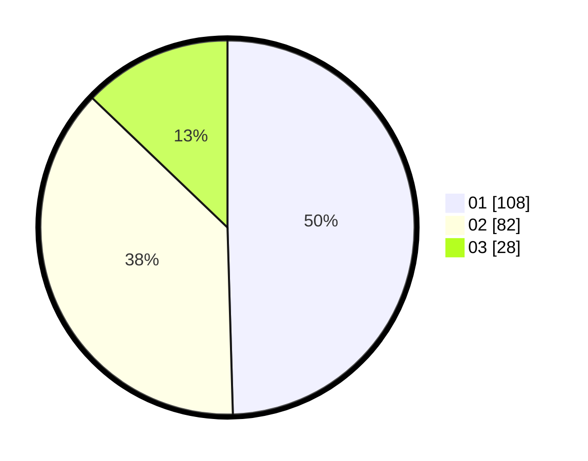

# Hasil

Hasil perolehan suara paslon dapat dilihat pada file paslon-01.txt, paslon-02.txt, dan paslon-03.txt.

Jika tidak ada, artinya data tersebut belum ada pada SIREKAP.

## Perolehan Suara

 * Paslon 01: **108**.
 * Paslon 02: **82**.
 * Paslon 03: **28**.

## Foto C Plano

https://sirekap-obj-formc.kpu.go.id/3e85/pemilu/ppwp/31/75/02/10/02/3175021002024-20240216-134736--c822febb-e6ee-44f7-bebf-9ffaece4509e.jpg

https://sirekap-obj-formc.kpu.go.id/3e85/pemilu/ppwp/31/75/02/10/02/3175021002024-20240216-134737--ce37b6c8-03f5-43aa-a88f-7619f08c9dfb.jpg

https://sirekap-obj-formc.kpu.go.id/3e85/pemilu/ppwp/31/75/02/10/02/3175021002024-20240216-134737--58921110-4a6b-449c-a766-a38295d1c762.jpg

## DATA PEMILIH TETAP

Jumlah pemilih dalam DPT: **275**.
 * L: **141**.
 * P: **134**.

## DATA PENGGUNA HAK PILIH

Jumlah pengguna hak pilih dalam DPT: **213**.
 * L: **106**.
 * P: **107**.

Jumlah pengguna hak pilih dalam DPTb: **7**.
 * L: **3**.
 * P: **4**.

Jumlah pengguna hak pilih dalam DPK: **1**.
 * L: **1**.
 * P: **0**.

Jumlah pengguna hak pilih: **221**.
 * L: **110**.
 * P: **111**.

## JUMLAH SUARA SAH DAN TIDAK SAH

JUMLAH SELURUH SUARA SAH: **218**.

JUMLAH SUARA TIDAK SAH: **3**.

JUMLAH SELURUH SUARA SAH DAN SUARA TIDAK SAH: **221**.
