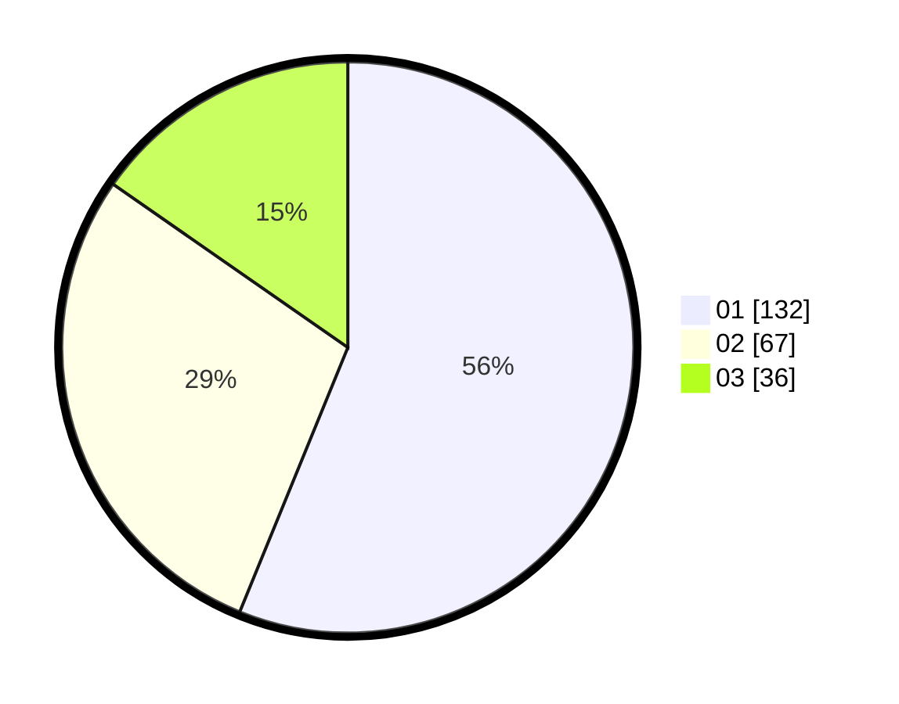

# Hasil

Hasil perolehan suara paslon dapat dilihat pada file paslon-01.txt, paslon-02.txt, dan paslon-03.txt.

Jika tidak ada, artinya data tersebut belum ada pada SIREKAP.

## Perolehan Suara

 * Paslon 01: **132**.
 * Paslon 02: **67**.
 * Paslon 03: **36**.

## Foto C Plano

https://sirekap-obj-formc.kpu.go.id/7391/pemilu/ppwp/31/75/02/10/02/3175021002025-20240214-214536--a31fe823-3765-43ba-b81c-6d47842d3879.jpg

https://sirekap-obj-formc.kpu.go.id/7391/pemilu/ppwp/31/75/02/10/02/3175021002025-20240216-114909--c4a5a233-597b-42c0-a5a0-d3967715cc9c.jpg

https://sirekap-obj-formc.kpu.go.id/7391/pemilu/ppwp/31/75/02/10/02/3175021002025-20240216-114904--784444df-15b0-4349-8afc-f9258890843f.jpg

## DATA PEMILIH TETAP

Jumlah pemilih dalam DPT: **265**.
 * L: **128**.
 * P: **137**.

## DATA PENGGUNA HAK PILIH

Jumlah pengguna hak pilih dalam DPT: **230**.
 * L: **104**.
 * P: **126**.

Jumlah pengguna hak pilih dalam DPTb: **7**.
 * L: **5**.
 * P: **2**.

Jumlah pengguna hak pilih dalam DPK: **1**.
 * L: **0**.
 * P: **1**.

Jumlah pengguna hak pilih: **238**.
 * L: **109**.
 * P: **129**.

## JUMLAH SUARA SAH DAN TIDAK SAH

JUMLAH SELURUH SUARA SAH: **235**.

JUMLAH SUARA TIDAK SAH: **3**.

JUMLAH SELURUH SUARA SAH DAN SUARA TIDAK SAH: **238**.
