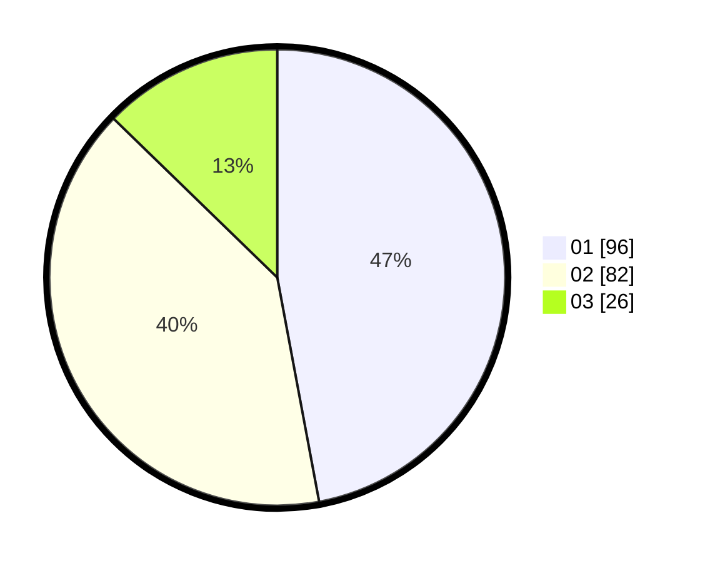

# Hasil

Hasil perolehan suara paslon dapat dilihat pada file paslon-01.txt, paslon-02.txt, dan paslon-03.txt.

Jika tidak ada, artinya data tersebut belum ada pada SIREKAP.

## Perolehan Suara

 * Paslon 01: **96**.
 * Paslon 02: **82**.
 * Paslon 03: **26**.

## Foto C Plano

https://sirekap-obj-formc.kpu.go.id/2ea7/pemilu/ppwp/31/75/02/10/02/3175021002026-20240217-222910--20ff836a-8f8f-4cba-96ef-1686698411c1.jpg

https://sirekap-obj-formc.kpu.go.id/2ea7/pemilu/ppwp/31/75/02/10/02/3175021002026-20240215-135207--929ba8e6-bebd-4744-be44-72aa9e4e1a71.jpg

https://sirekap-obj-formc.kpu.go.id/2ea7/pemilu/ppwp/31/75/02/10/02/3175021002026-20240217-233300--2a1c2b08-eb66-429b-abdc-21c03ed1a169.jpg

## DATA PEMILIH TETAP

Jumlah pemilih dalam DPT: **258**.
 * L: **122**.
 * P: **136**.

## DATA PENGGUNA HAK PILIH

Jumlah pengguna hak pilih dalam DPT: **198**.
 * L: **96**.
 * P: **102**.

Jumlah pengguna hak pilih dalam DPTb: **7**.
 * L: **5**.
 * P: **2**.

Jumlah pengguna hak pilih dalam DPK: **2**.
 * L: **1**.
 * P: **1**.

Jumlah pengguna hak pilih: **207**.
 * L: **102**.
 * P: **105**.

## JUMLAH SUARA SAH DAN TIDAK SAH

JUMLAH SELURUH SUARA SAH: **204**.

JUMLAH SUARA TIDAK SAH: **3**.

JUMLAH SELURUH SUARA SAH DAN SUARA TIDAK SAH: **207**.
