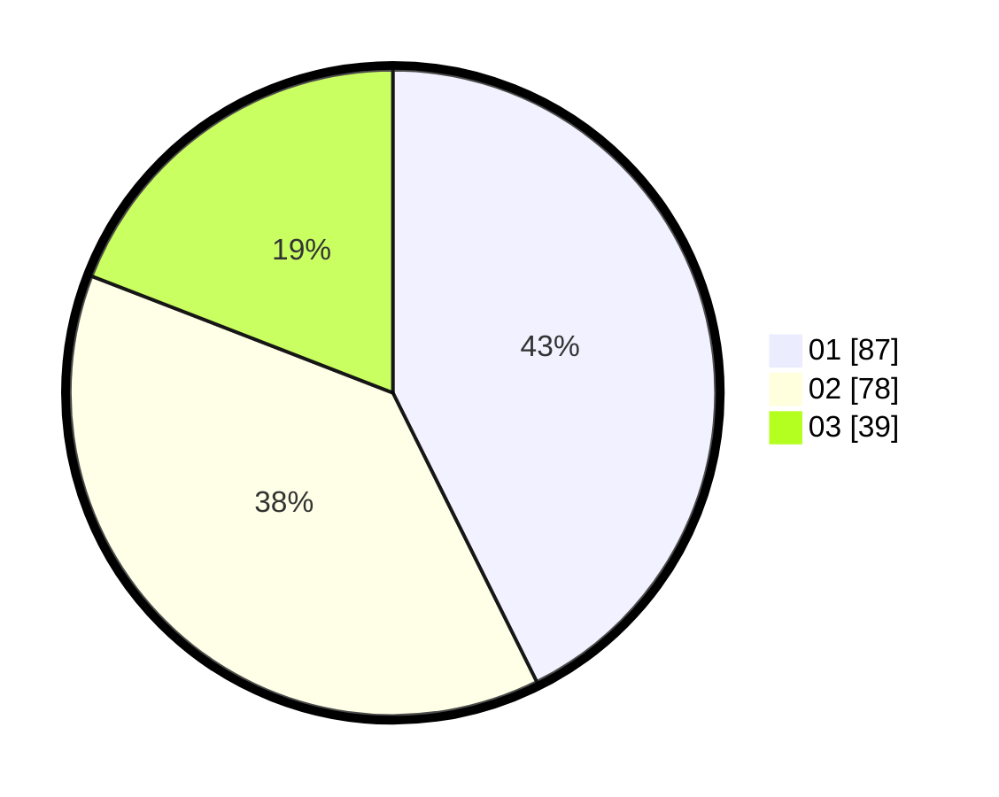

# Hasil

Hasil perolehan suara paslon dapat dilihat pada file paslon-01.txt, paslon-02.txt, dan paslon-03.txt.

Jika tidak ada, artinya data tersebut belum ada pada SIREKAP.

## Perolehan Suara

 * Paslon 01: **87**.
 * Paslon 02: **78**.
 * Paslon 03: **39**.

## Foto C Plano

https://sirekap-obj-formc.kpu.go.id/c96a/pemilu/ppwp/31/75/02/10/02/3175021002029-20240214-213324--4af82d5f-8a9e-4833-9999-aba0fee3f68a.jpg

https://sirekap-obj-formc.kpu.go.id/c96a/pemilu/ppwp/31/75/02/10/02/3175021002029-20240214-213503--cfcdf125-7388-4d38-a97c-9d81d2a831fc.jpg

https://sirekap-obj-formc.kpu.go.id/c96a/pemilu/ppwp/31/75/02/10/02/3175021002029-20240214-213738--fe61648a-f408-4071-9629-c1db18066237.jpg

## DATA PEMILIH TETAP

Jumlah pemilih dalam DPT: **274**.
 * L: **132**.
 * P: **142**.

## DATA PENGGUNA HAK PILIH

Jumlah pengguna hak pilih dalam DPT: **195**.
 * L: **88**.
 * P: **107**.

Jumlah pengguna hak pilih dalam DPTb: **10**.
 * L: **4**.
 * P: **6**.

Jumlah pengguna hak pilih dalam DPK: **0**.
 * L: **0**.
 * P: **0**.

Jumlah pengguna hak pilih: **205**.
 * L: **92**.
 * P: **113**.

## JUMLAH SUARA SAH DAN TIDAK SAH

JUMLAH SELURUH SUARA SAH: **204**.

JUMLAH SUARA TIDAK SAH: **1**.

JUMLAH SELURUH SUARA SAH DAN SUARA TIDAK SAH: **205**.
