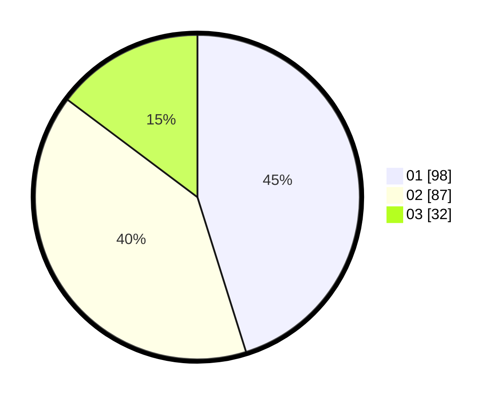

# Hasil

Hasil perolehan suara paslon dapat dilihat pada file paslon-01.txt, paslon-02.txt, dan paslon-03.txt.

Jika tidak ada, artinya data tersebut belum ada pada SIREKAP.

## Perolehan Suara

 * Paslon 01: **98**.
 * Paslon 02: **87**.
 * Paslon 03: **32**.

## Foto C Plano

https://sirekap-obj-formc.kpu.go.id/5c0a/pemilu/ppwp/31/75/02/10/02/3175021002030-20240216-150847--79f255a1-c8ee-424c-8c7f-9112987b9f7c.jpg

https://sirekap-obj-formc.kpu.go.id/5c0a/pemilu/ppwp/31/75/02/10/02/3175021002030-20240216-150848--6e795998-138f-46b8-8e63-c86ed2a89ec5.jpg

https://sirekap-obj-formc.kpu.go.id/5c0a/pemilu/ppwp/31/75/02/10/02/3175021002030-20240216-150847--1ee6cc67-b38d-4a6b-b2aa-5c91764d283c.jpg

## DATA PEMILIH TETAP

Jumlah pemilih dalam DPT: **268**.
 * L: **128**.
 * P: **140**.

## DATA PENGGUNA HAK PILIH

Jumlah pengguna hak pilih dalam DPT: **220**.
 * L: **105**.
 * P: **115**.

Jumlah pengguna hak pilih dalam DPTb: **3**.
 * L: **1**.
 * P: **2**.

Jumlah pengguna hak pilih dalam DPK: **0**.
 * L: **0**.
 * P: **0**.

Jumlah pengguna hak pilih: **223**.
 * L: **106**.
 * P: **117**.

## JUMLAH SUARA SAH DAN TIDAK SAH

JUMLAH SELURUH SUARA SAH: **217**.

JUMLAH SUARA TIDAK SAH: **6**.

JUMLAH SELURUH SUARA SAH DAN SUARA TIDAK SAH: **223**.
