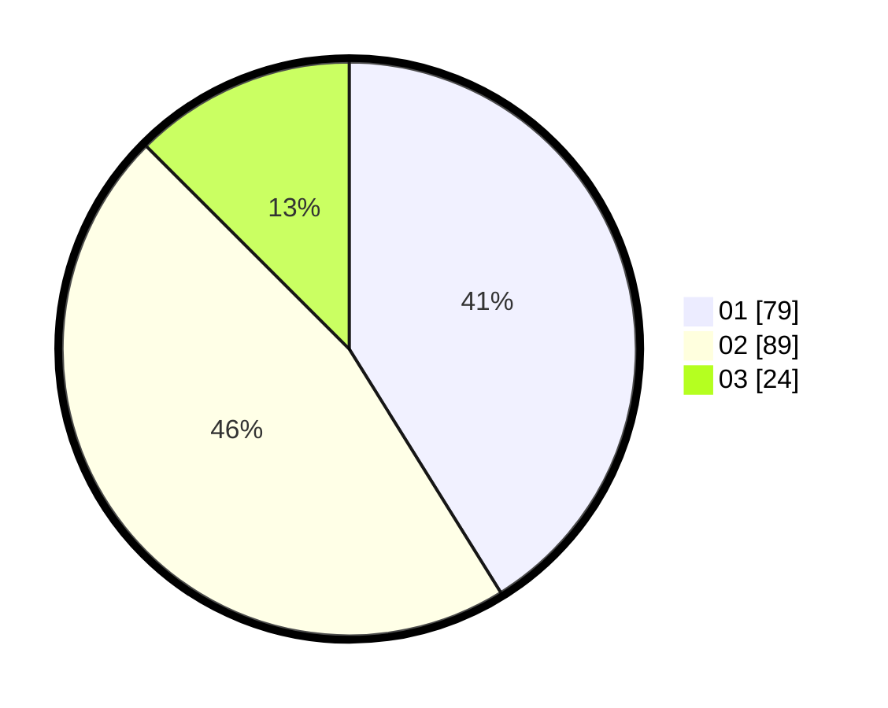

# Hasil

Hasil perolehan suara paslon dapat dilihat pada file paslon-01.txt, paslon-02.txt, dan paslon-03.txt.

Jika tidak ada, artinya data tersebut belum ada pada SIREKAP.

## Perolehan Suara

 * Paslon 01: **79**.
 * Paslon 02: **89**.
 * Paslon 03: **24**.

## Foto C Plano

https://sirekap-obj-formc.kpu.go.id/26d3/pemilu/ppwp/31/75/02/10/02/3175021002032-20240215-011649--64dc5067-695b-4378-a999-67a159147a49.jpg

https://sirekap-obj-formc.kpu.go.id/26d3/pemilu/ppwp/31/75/02/10/02/3175021002032-20240215-011735--5b438de1-3746-47eb-b4e0-d55cffc854c0.jpg

https://sirekap-obj-formc.kpu.go.id/26d3/pemilu/ppwp/31/75/02/10/02/3175021002032-20240215-011845--29fcbda7-728e-4cbb-b9c3-29fe607247c9.jpg
