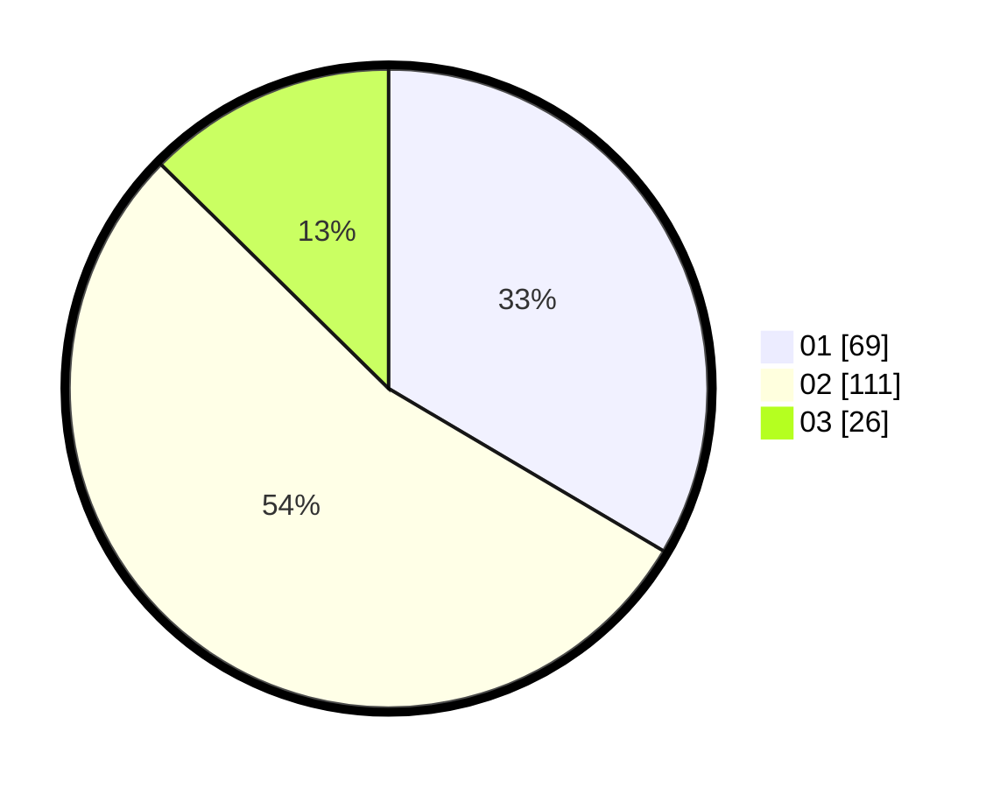

# Hasil

Hasil perolehan suara paslon dapat dilihat pada file paslon-01.txt, paslon-02.txt, dan paslon-03.txt.

Jika tidak ada, artinya data tersebut belum ada pada SIREKAP.

## Perolehan Suara

 * Paslon 01: **69**.
 * Paslon 02: **111**.
 * Paslon 03: **26**.

## Foto C Plano

https://sirekap-obj-formc.kpu.go.id/f35c/pemilu/ppwp/31/75/02/10/02/3175021002033-20240214-202322--67218585-7c62-4025-b7f1-f8fe79abea86.jpg

https://sirekap-obj-formc.kpu.go.id/f35c/pemilu/ppwp/31/75/02/10/02/3175021002033-20240214-202509--87f5ca68-0c64-489e-b8fb-c636148b2bbe.jpg

https://sirekap-obj-formc.kpu.go.id/f35c/pemilu/ppwp/31/75/02/10/02/3175021002033-20240214-202557--da5120fb-56c7-496d-9832-7a73be6e478b.jpg

## DATA PEMILIH TETAP

Jumlah pemilih dalam DPT: **270**.
 * L: **126**.
 * P: **144**.

## DATA PENGGUNA HAK PILIH

Jumlah pengguna hak pilih dalam DPT: **208**.
 * L: **98**.
 * P: **110**.

Jumlah pengguna hak pilih dalam DPTb: **0**.
 * L: **0**.
 * P: **0**.

Jumlah pengguna hak pilih dalam DPK: **0**.
 * L: **0**.
 * P: **0**.

Jumlah pengguna hak pilih: **208**.
 * L: **98**.
 * P: **110**.

## JUMLAH SUARA SAH DAN TIDAK SAH

JUMLAH SELURUH SUARA SAH: **206**.

JUMLAH SUARA TIDAK SAH: **2**.

JUMLAH SELURUH SUARA SAH DAN SUARA TIDAK SAH: **208**.
