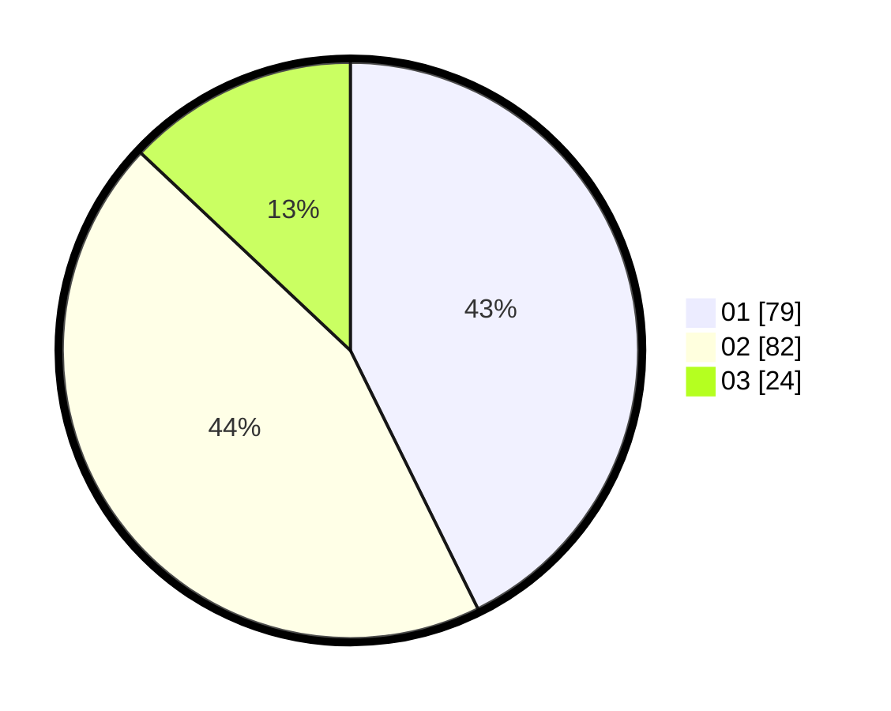

# Hasil

Hasil perolehan suara paslon dapat dilihat pada file paslon-01.txt, paslon-02.txt, dan paslon-03.txt.

Jika tidak ada, artinya data tersebut belum ada pada SIREKAP.

## Perolehan Suara

 * Paslon 01: **79**.
 * Paslon 02: **82**.
 * Paslon 03: **24**.

## Foto C Plano

https://sirekap-obj-formc.kpu.go.id/86c5/pemilu/ppwp/31/75/02/10/02/3175021002038-20240214-193418--8a1a59ac-713d-4fb1-8c9e-71b3a1d775ee.jpg

https://sirekap-obj-formc.kpu.go.id/86c5/pemilu/ppwp/31/75/02/10/02/3175021002038-20240214-192115--824cdc86-26bd-4ab4-a9aa-d3c6bebd6cc9.jpg

https://sirekap-obj-formc.kpu.go.id/86c5/pemilu/ppwp/31/75/02/10/02/3175021002038-20240214-192816--f1ce34f0-72cc-4e48-9a96-e53f582fa109.jpg

## DATA PEMILIH TETAP

Jumlah pemilih dalam DPT: **273**.
 * L: **139**.
 * P: **134**.

## DATA PENGGUNA HAK PILIH

Jumlah pengguna hak pilih dalam DPT: **183**.
 * L: **95**.
 * P: **88**.

Jumlah pengguna hak pilih dalam DPTb: **1**.
 * L: **0**.
 * P: **1**.

Jumlah pengguna hak pilih dalam DPK: **3**.
 * L: **2**.
 * P: **1**.

Jumlah pengguna hak pilih: **187**.
 * L: **97**.
 * P: **90**.

## JUMLAH SUARA SAH DAN TIDAK SAH

JUMLAH SELURUH SUARA SAH: **185**.

JUMLAH SUARA TIDAK SAH: **2**.

JUMLAH SELURUH SUARA SAH DAN SUARA TIDAK SAH: **187**.
