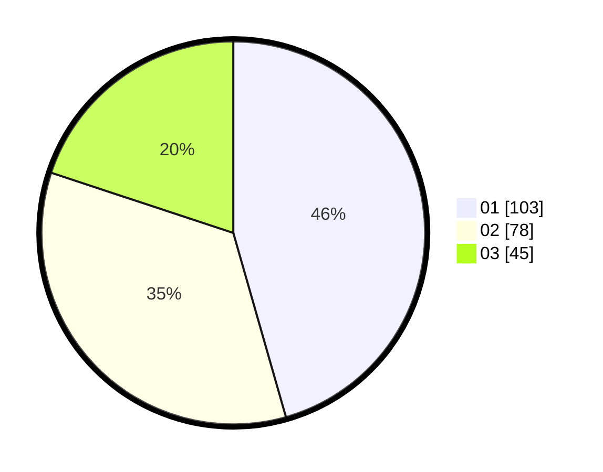

# Hasil

Hasil perolehan suara paslon dapat dilihat pada file paslon-01.txt, paslon-02.txt, dan paslon-03.txt.

Jika tidak ada, artinya data tersebut belum ada pada SIREKAP.

## Perolehan Suara

 * Paslon 01: **103**.
 * Paslon 02: **78**.
 * Paslon 03: **45**.

## Foto C Plano

https://sirekap-obj-formc.kpu.go.id/a873/pemilu/ppwp/31/75/02/10/02/3175021002040-20240215-213132--1ae6445f-dc65-4733-bdbc-5c7a9ac7660d.jpg

https://sirekap-obj-formc.kpu.go.id/a873/pemilu/ppwp/31/75/02/10/02/3175021002040-20240215-213135--70659977-f4a1-43cb-92f5-2b9c1f77c122.jpg

https://sirekap-obj-formc.kpu.go.id/a873/pemilu/ppwp/31/75/02/10/02/3175021002040-20240215-213133--0cd3124d-c348-4aea-b4ee-140780e6df0e.jpg

## DATA PEMILIH TETAP

Jumlah pemilih dalam DPT: **276**.
 * L: **137**.
 * P: **139**.

## DATA PENGGUNA HAK PILIH

Jumlah pengguna hak pilih dalam DPT: **222**.
 * L: **107**.
 * P: **115**.

Jumlah pengguna hak pilih dalam DPTb: **10**.
 * L: **6**.
 * P: **4**.

Jumlah pengguna hak pilih dalam DPK: **0**.
 * L: **0**.
 * P: **0**.

Jumlah pengguna hak pilih: **232**.
 * L: **113**.
 * P: **119**.

## JUMLAH SUARA SAH DAN TIDAK SAH

JUMLAH SELURUH SUARA SAH: **226**.

JUMLAH SUARA TIDAK SAH: **6**.

JUMLAH SELURUH SUARA SAH DAN SUARA TIDAK SAH: **232**.
