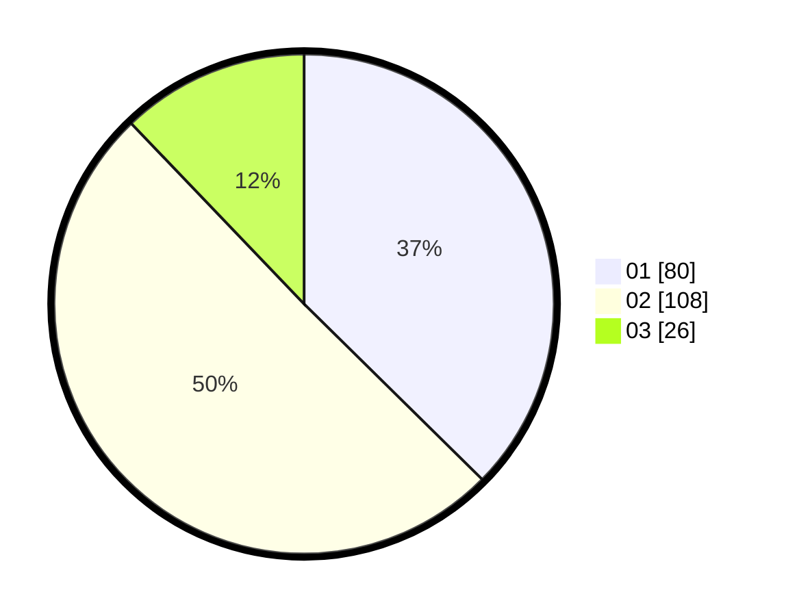

# Hasil

Hasil perolehan suara paslon dapat dilihat pada file paslon-01.txt, paslon-02.txt, dan paslon-03.txt.

Jika tidak ada, artinya data tersebut belum ada pada SIREKAP.

## Perolehan Suara

 * Paslon 01: **80**.
 * Paslon 02: **108**.
 * Paslon 03: **26**.

## Foto C Plano

https://sirekap-obj-formc.kpu.go.id/8c14/pemilu/ppwp/31/75/02/10/02/3175021002043-20240214-225139--bfcf9722-0bc0-4c2e-a6f2-333a6be10ca5.jpg

https://sirekap-obj-formc.kpu.go.id/8c14/pemilu/ppwp/31/75/02/10/02/3175021002043-20240214-225232--585c02f5-5411-421a-9870-25070e78d387.jpg

https://sirekap-obj-formc.kpu.go.id/8c14/pemilu/ppwp/31/75/02/10/02/3175021002043-20240214-225310--1f532c7e-2d78-4cf2-b95f-044c97e5eb82.jpg
