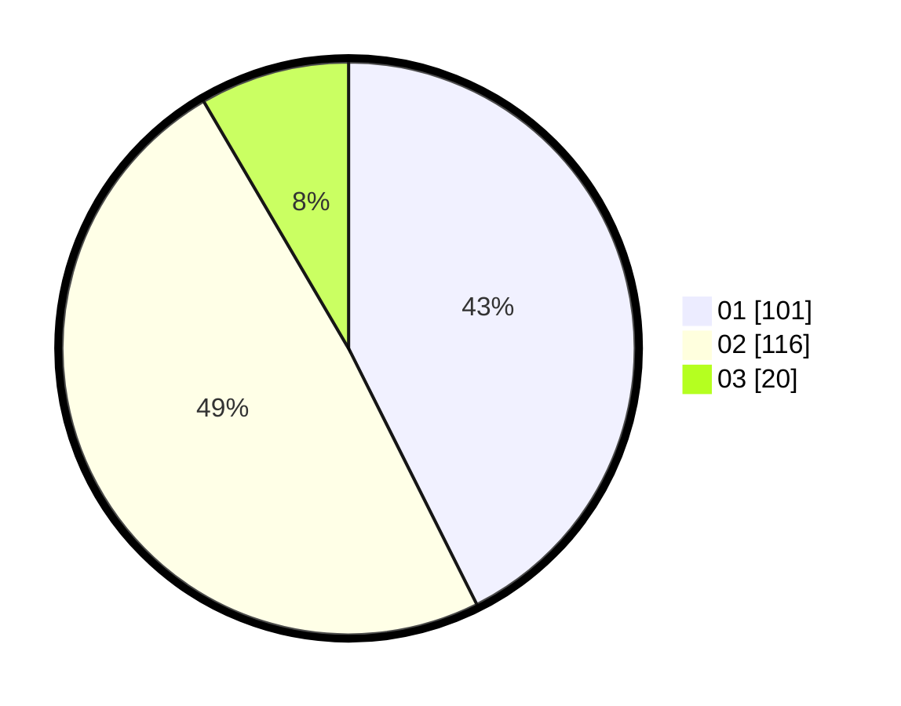

# Hasil

Hasil perolehan suara paslon dapat dilihat pada file paslon-01.txt, paslon-02.txt, dan paslon-03.txt.

Jika tidak ada, artinya data tersebut belum ada pada SIREKAP.

## Perolehan Suara

 * Paslon 01: **101**.
 * Paslon 02: **116**.
 * Paslon 03: **20**.

## Foto C Plano

https://sirekap-obj-formc.kpu.go.id/13c7/pemilu/ppwp/31/75/02/10/02/3175021002045-20240214-193908--1b8af1fe-5f1c-4735-ba8d-e5069a444630.jpg

https://sirekap-obj-formc.kpu.go.id/13c7/pemilu/ppwp/31/75/02/10/02/3175021002045-20240214-192721--a85a3641-4456-4c04-8394-f9bf016f4bdf.jpg

https://sirekap-obj-formc.kpu.go.id/13c7/pemilu/ppwp/31/75/02/10/02/3175021002045-20240214-193744--b83806bf-bb3b-4865-8cda-a06b9f49a500.jpg

## DATA PEMILIH TETAP

Jumlah pemilih dalam DPT: **279**.
 * L: **137**.
 * P: **142**.

## DATA PENGGUNA HAK PILIH

Jumlah pengguna hak pilih dalam DPT: **227**.
 * L: **110**.
 * P: **117**.

Jumlah pengguna hak pilih dalam DPTb: **11**.
 * L: **10**.
 * P: **1**.

Jumlah pengguna hak pilih dalam DPK: **1**.
 * L: **1**.
 * P: **0**.

Jumlah pengguna hak pilih: **239**.
 * L: **121**.
 * P: **118**.

## JUMLAH SUARA SAH DAN TIDAK SAH

JUMLAH SELURUH SUARA SAH: **237**.

JUMLAH SUARA TIDAK SAH: **2**.

JUMLAH SELURUH SUARA SAH DAN SUARA TIDAK SAH: **239**.
