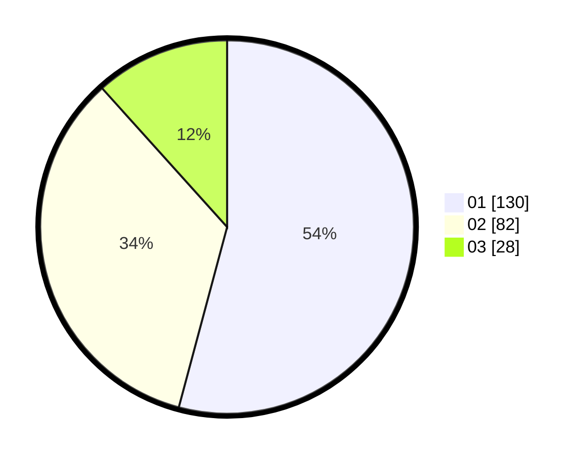

# Hasil

Hasil perolehan suara paslon dapat dilihat pada file paslon-01.txt, paslon-02.txt, dan paslon-03.txt.

Jika tidak ada, artinya data tersebut belum ada pada SIREKAP.

## Perolehan Suara

 * Paslon 01: **130**.
 * Paslon 02: **82**.
 * Paslon 03: **28**.

## Foto C Plano

https://sirekap-obj-formc.kpu.go.id/82ca/pemilu/ppwp/31/75/02/10/02/3175021002046-20240216-090133--5855ec2a-ac58-4e13-9e55-1e5f89a63fef.jpg

https://sirekap-obj-formc.kpu.go.id/82ca/pemilu/ppwp/31/75/02/10/02/3175021002046-20240214-233417--f098e591-6d58-4d5b-b9cb-b4f9d482d783.jpg

https://sirekap-obj-formc.kpu.go.id/82ca/pemilu/ppwp/31/75/02/10/02/3175021002046-20240216-090134--728ebd87-72b1-442d-95a5-1fdebb1f09fb.jpg

## DATA PEMILIH TETAP

Jumlah pemilih dalam DPT: **276**.
 * L: **153**.
 * P: **123**.

## DATA PENGGUNA HAK PILIH

Jumlah pengguna hak pilih dalam DPT: **231**.
 * L: **128**.
 * P: **103**.

Jumlah pengguna hak pilih dalam DPTb: **10**.
 * L: **5**.
 * P: **5**.

Jumlah pengguna hak pilih dalam DPK: **3**.
 * L: **1**.
 * P: **2**.

Jumlah pengguna hak pilih: **244**.
 * L: **134**.
 * P: **110**.

## JUMLAH SUARA SAH DAN TIDAK SAH

JUMLAH SELURUH SUARA SAH: **240**.

JUMLAH SUARA TIDAK SAH: **4**.

JUMLAH SELURUH SUARA SAH DAN SUARA TIDAK SAH: **244**.
