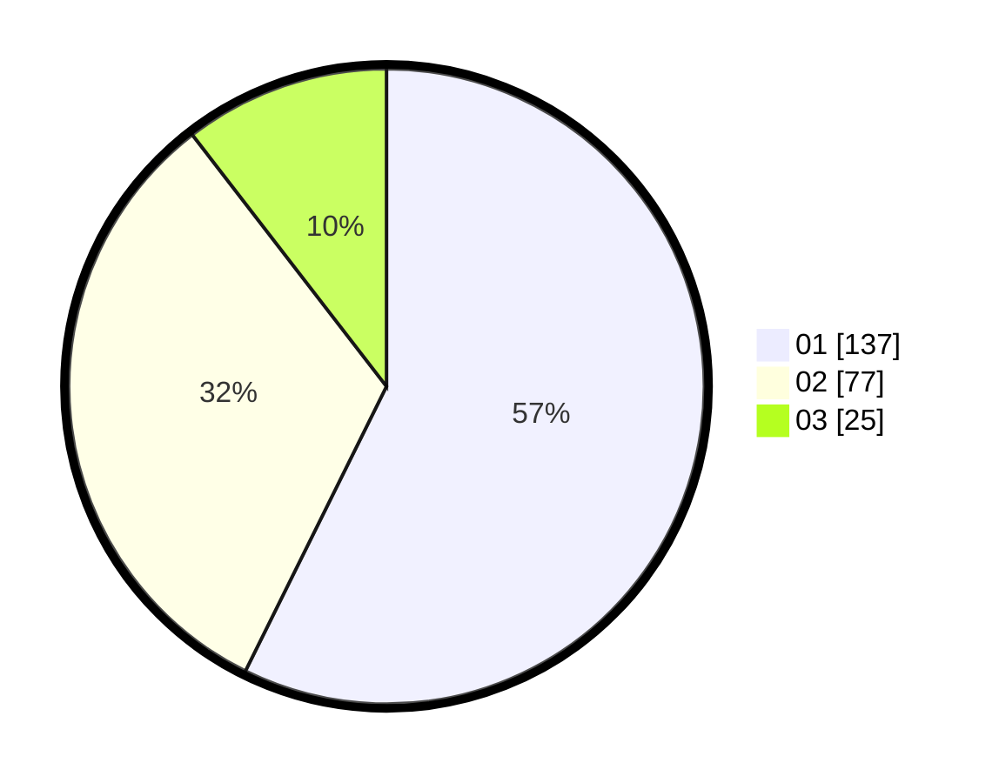

# Hasil

Hasil perolehan suara paslon dapat dilihat pada file paslon-01.txt, paslon-02.txt, dan paslon-03.txt.

Jika tidak ada, artinya data tersebut belum ada pada SIREKAP.

## Perolehan Suara

 * Paslon 01: **137**.
 * Paslon 02: **77**.
 * Paslon 03: **25**.

## Foto C Plano

https://sirekap-obj-formc.kpu.go.id/b83b/pemilu/ppwp/31/75/02/10/02/3175021002048-20240216-133549--1e0c209b-8b42-4826-80f5-2d63f14af17f.jpg

https://sirekap-obj-formc.kpu.go.id/b83b/pemilu/ppwp/31/75/02/10/02/3175021002048-20240216-133550--d4b31f83-564a-4efa-94ca-ace672554f55.jpg

https://sirekap-obj-formc.kpu.go.id/b83b/pemilu/ppwp/31/75/02/10/02/3175021002048-20240216-133550--45de8459-1115-4dd1-a146-be7dc551f50b.jpg

## DATA PEMILIH TETAP

Jumlah pemilih dalam DPT: **279**.
 * L: **135**.
 * P: **144**.

## DATA PENGGUNA HAK PILIH

Jumlah pengguna hak pilih dalam DPT: **227**.
 * L: **108**.
 * P: **119**.

Jumlah pengguna hak pilih dalam DPTb: **16**.
 * L: **5**.
 * P: **11**.

Jumlah pengguna hak pilih dalam DPK: **1**.
 * L: **1**.
 * P: **0**.

Jumlah pengguna hak pilih: **244**.
 * L: **113**.
 * P: **131**.

## JUMLAH SUARA SAH DAN TIDAK SAH

JUMLAH SELURUH SUARA SAH: **239**.

JUMLAH SUARA TIDAK SAH: **5**.

JUMLAH SELURUH SUARA SAH DAN SUARA TIDAK SAH: **244**.
